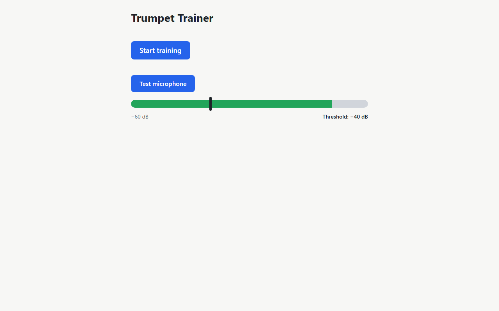
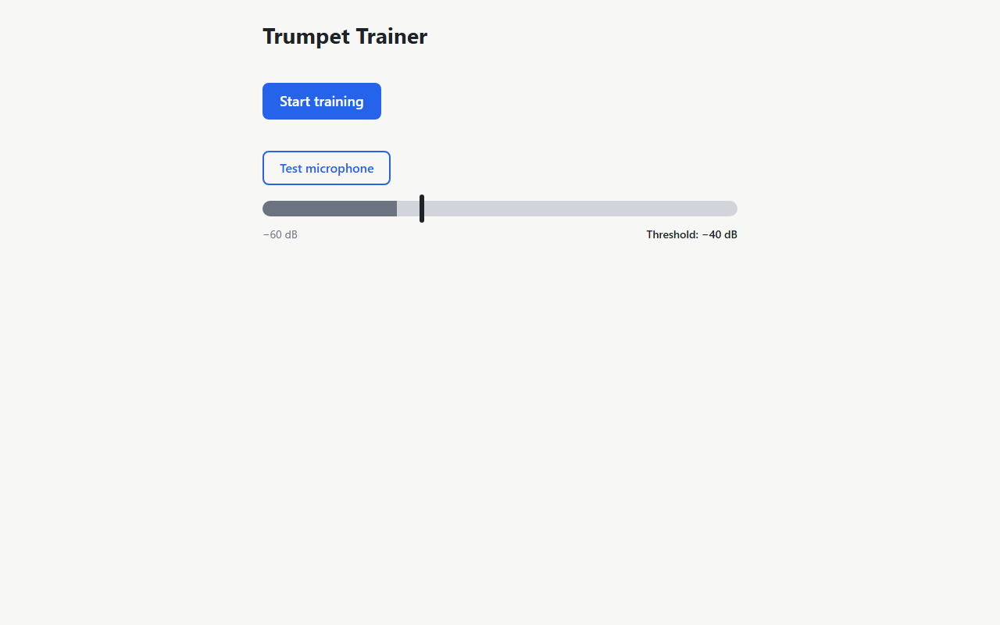
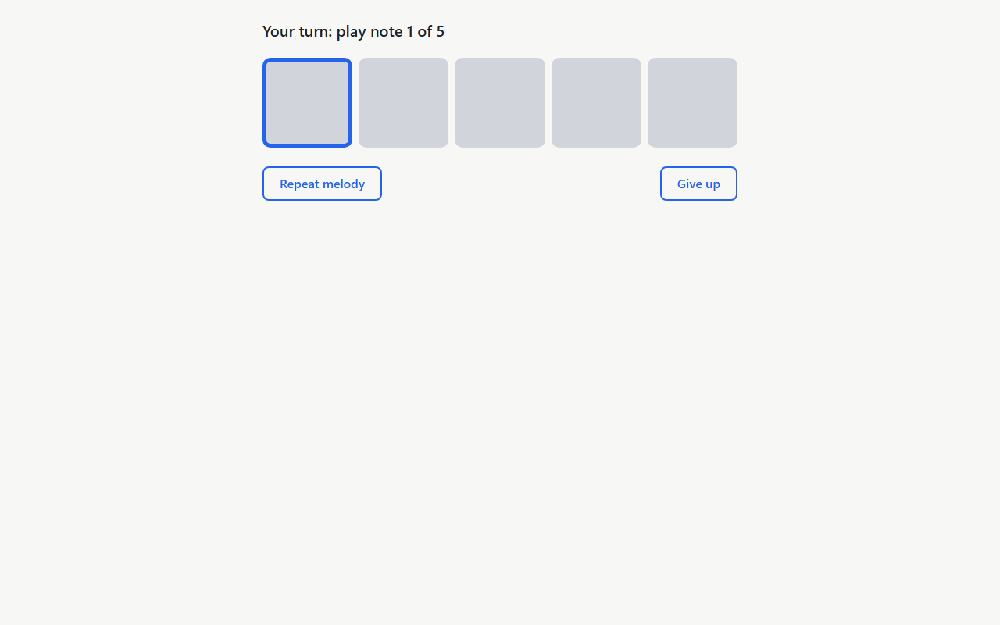
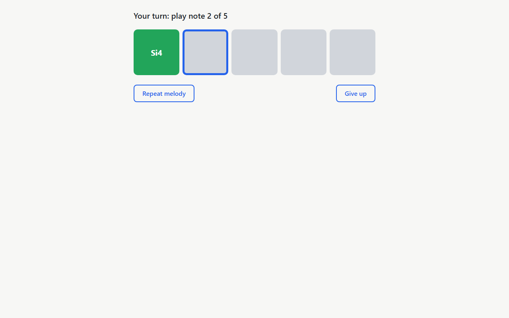

# Validation Report — Run 2 (re-validation after /t-fix: preview base path + e2e cacheDir)

- **Round:** re-run of all original checks after the two Run 1 fixes (`vite.config.ts`: `isPreview` base, separate `cacheDir` in e2e mode). `validation.md` has no appendix sections, so there are no appendix checks.
- **Feature:** create-mvp (Trumpet Trainer MVP) — checklist `specs/create-mvp/validation.md`
- **Started:** 2026-10-02T22:25:12.777Z  ·  **Finished:** 2026-10-02T22:27:43.824Z
- **Host:** win32 x64, Node v20.16.0
- **Script:** `specs/create-mvp/validation-run-2/validate.mjs` (wrapper `run.sh`)
- **Environment log:** [create-environment.txt](run-2/output/create-environment.txt)

**Summary:** 31 passed, 0 failed, 1 skipped

> Items marked "proxy" use Chromium's fake microphone (a looping 440 Hz tone = written Si4) and the e2e-mode `?melody=` hook instead of a real trumpet. Real-instrument tuning, speaker→mic leakage, audible timbre and OS mic indicators remain manual checks.

## Comparison with previous run (Run 1)

**No regressions:** every check that passed in Run 1 still passes.

| Check | Run 1 | Run 2 | Change |
|---|---|---|---|
| P1-6 Production preview under /trumpet-trainer/ | FAIL | PASS | fixed |
| P2-9 Speaker playback never turns a box green | FAIL | PASS | fixed |
| P2-10 Correct note turns box green and advances | FAIL | PASS | fixed |
| P2-11 Wrong note / octave off changes nothing | FAIL | PASS | fixed |
| P2-12 Repeat melody | FAIL | PASS | fixed |
| P2-13 Give up | FAIL | PASS | fixed |
| P2-14 Complete all 5 notes | FAIL | PASS | fixed |
| P2-15 Threshold 0 dB blocks detection | FAIL | PASS | fixed |
| P2-16 ?melody=71,71,71,71,71 on the e2e-mode server | FAIL | PASS | fixed |
| P2-17 ?melody ignored on dev and production preview | FAIL | PASS | fixed |

# Re-run of original checks

## Part 1 (prd.md)

### Scaffold and tooling

- ✅ **P1-1 Unit tests (`npm test`)** — 21 test files / 309 tests (309 passed, 0 failed), exit 0. Part 1's expected 13 files / 196 tests are superseded by Part 2's 20 files / 302 tests, and the /t-fix round added viteConfig.test.ts (21 files / 309 tests expected).
  - Output: [01-npm-test.txt](run-2/output/01-npm-test.txt)
- ✅ **P1-2 Lint and typecheck** — lint exit 0, no problems printed; typecheck exit 0, no output
  - Output: [02-lint.txt](run-2/output/02-lint.txt), [03-typecheck.txt](run-2/output/03-typecheck.txt)
- ✅ **P1-3 E2E (`npm run test:e2e`)** — exit 0; tone fixture regenerated; Playwright: 3 passed, 0 failed, 0 flaky. (Part 1 expected "no specs yet"; Part 2 now ships 3 specs.)
  - Output: [04-test-e2e.txt](run-2/output/04-test-e2e.txt)
- ✅ **P1-4 tsconfig strict** — tsconfig.json compilerOptions.strict = true

### App shell and dependency injection

- ✅ **P1-5 Dev server renders the app shell** — title "Trumpet Trainer", heading "Trumpet Trainer" visible, console errors: 0.
  - Output: [11-console-dev.txt](run-2/output/11-console-dev.txt)

  

- ✅ **P1-6 Production preview under /trumpet-trainer/** — Heading rendered: true; 1 JS + 1 CSS asset(s) requested under /trumpet-trainer/assets/, all 200 with the right content type: yes.
  - Output: [12-preview-assets.txt](run-2/output/12-preview-assets.txt)

  

### Constants

- ✅ **P1-7 Constants match the PRD table** — 26/26 PRD constants match (values read from the live module via the dev server); extra helpers: 6.
  - Output: [13-constants-compare.md](run-2/output/13-constants-compare.md)

### Music domain

- ✅ **P1-8 Music tests incl. 7 spelling worked examples** — exit 0; 3 files / 72 tests, 0 failed; suites seen: notes.test.ts, spelling.test.ts, melody.test.ts; worked-example rows: 7/7; row [54,61,61,58,72] → Fa#3, Do#4, Do#4, Si♭3, Do5 found (exact).
  - Output: [05-vitest-music.txt](run-2/output/05-vitest-music.txt)

### Audio domain

- ✅ **P1-9 Audio + training tests** — exit 0; 10 files / 146 tests, 0 failed; suites missing: none; pitch cases (E3/A4/B♭4 sine+sawtooth, null for silence/noise/100 Hz/800 Hz) missing: none.
  - Output: [06-vitest-audio-training.txt](run-2/output/06-vitest-audio-training.txt)
- ✅ **P1-10 Fake-mic fixture WAV** — 384044 bytes (≈375 KB), 48000 Hz / 1 ch / 16-bit, 4.00 s, ≈439.8 Hz steady across all 0.5 s windows, RMS -9.0 dBFS. "Plays a steady tone" verified by signal analysis instead of by ear.
  - Output: [07-wav-analysis.txt](run-2/output/07-wav-analysis.txt)
- ✅ **P1-11 Synth playback in a real browser** — p.done resolved after 2756 ms (expected ≈2.5 s, window 2.2–3.5 s), 'done' returned; 5 oscillator attacks at 440.0, 440.0, 293.7, 349.2, 466.2 Hz (expected 440, 440, 293.7, 349.2, 466.2). Brass-like timbre / audibly separate attacks are a human-ear check (5 separate oscillators with per-note envelopes verified).
  - Output: [14-synth-playback.json](run-2/output/14-synth-playback.json)
- ✅ **P1-12 Microphone frames + pitch detection in a real browser** — getUserMedia called once; 91 frames in 1.5 s at 48000 Hz; levels finite in [−100, 0] dBFS: true (range -100.0…-9.0); 88/91 frames detected 440±5 Hz, 0 out-of-range values; after off()+release(): 0 more frames, tracks live → ended. Uses the fake 440 Hz mic (real humming/trumpet and the OS mic indicator remain manual).
  - Output: [15-mic-frames.json](run-2/output/15-mic-frames.json)
- ✅ **P1-13 Denied microphone maps to permission-denied** — Simulated denial (getUserMedia → DOMException NotAllowedError) returned 'permission-denied'; microphone.ts maps NotAllowedError/SecurityError → permission-denied: true. Real headless-shell denial returned 'unknown' (headless shell has no permission UI and reports NotSupportedError), so blocking via real site settings stays a manual check.
  - Output: [16-mic-denied.txt](run-2/output/16-mic-denied.txt)

## Part 2 (prd2.md)

### Automated checks

- ✅ **P2-1 npm test / lint / typecheck** — npm test: 21 test files / 309 tests (309 passed, 0 failed), exit 0 — matches expected 21 / 309 (validation.md 20 / 302 + viteConfig.test.ts); lint exit 0, no problems printed; typecheck exit 0, no output.
  - Output: [01-npm-test.txt](run-2/output/01-npm-test.txt), [02-lint.txt](run-2/output/02-lint.txt), [03-typecheck.txt](run-2/output/03-typecheck.txt)
- ✅ **P2-2 Playwright e2e specs** — Expected 3 passed (mic meter, matching melody, non-matching melody); got 3 passed, 0 failed, exit 0.
  - Output: [04-test-e2e.txt](run-2/output/04-test-e2e.txt)

### Home screen

- ✅ **P2-3 Home screen initial state** — Heading + "Start training" (enabled) visible; Test microphone aria-pressed="false"; meter aria-valuenow=-60 (min -60); slider value -40; label "Threshold: −40 dB" (U+2212 minus: true).

  

- ✅ **P2-4 Test microphone toggle and level meter** — On: aria-pressed=true, meter aria-valuenow=-9 dBFS (fake 440 Hz tone, fill width 84.8947%), fill class "mic-meter__fill mic-meter__fill--ok" (green rgb(34, 165, 90)) above the −40 threshold. Off: aria-pressed=false, aria-valuenow=−60, fill rgb(107, 114, 128), mic tracks ended (mic released → browser indicator off).

  

  

- ✅ **P2-5 Threshold slider** — Slider set to −20 → label "Threshold: −20 dB", slider value -20 (marker at 67% of the bar vs 33% before — see screenshots). Level -9 dBFS ≥ −20 → fill green: true (expected true). At 0 dB threshold, level -9 → green: false (expected false).

  

  

### Microphone errors

- ✅ **P2-6 Blocked microphone shows inline alert** — Alert: "Microphone access is blocked. Allow the microphone for this site (usually via the icon in the address bar or your browser's site settings), then press Start training again."; Start training enabled: true; Training screen shown: false; oscillators started (melody played): 0. Denial simulated by getUserMedia rejecting with NotAllowedError (headless Chromium has no site-settings UI).

  

- ✅ **P2-7 Allowed microphone starts training** — After allowing the microphone, Start training → alert count 0, Training screen shown with status "Listen…".

  

### Training flow

- ✅ **P2-8 Start training: playing → guard → listening** — Status sequence 55ms:"Listen…" → 2614ms:"Get ready…" → 2882ms:"Your turn: play note 1 of 5" (t=0 at click). Click → "Get ready…" 2614 ms (≈2.5 s expected), guard 268 ms (250 expected). Boxes at start: active, pending, pending, pending, pending; Repeat/Give up disabled while playing: true/true, enabled when listening: true/true. Melody oscillators (last 5): 370.0, 174.6, 466.2, 246.9, 220.0 Hz. Audibility of the 5 notes is a human-ear check.
- ✅ **P2-9 Speaker playback never turns a box green** — Proxy on 5174 with ?melody=60,62,64,65,67 (none matches the fake 440 Hz mic): through playback, guard and 3 s of listening no box turned done (done transitions: 0; boxes active, pending, pending, pending, pending). Real speaker → microphone acoustic leakage needs a human with speakers and a real mic (manual).

  

- ✅ **P2-10 Correct note turns box green and advances** — Proxy on 5174 ?melody=71,60,60,60,60 with the fake 440 Hz tone: box 1 turned done showing "Si4" 520 ms after listening started (≥500 ms sustain), highlight moved to box 2 (done, active, pending, pending, pending), status "Your turn: play note 2 of 5". Playing other notes on a real trumpet (and other spellings like Fa#3 / Si♭3) remains manual.

  

- ✅ **P2-11 Wrong note / octave off changes nothing** — Proxy on 5174 with the fake 440 Hz tone. wrong note (target written Do4 = 233 Hz concert, mic plays 440 Hz): after 3 s of listening, done transitions 0, box 1 active, status "Your turn: play note 1 of 5" → unchanged; octave off (target written Si3 = 220 Hz concert, mic plays 440 Hz — one octave above): after 3 s of listening, done transitions 0, box 1 active, status "Your turn: play note 1 of 5" → unchanged. Real trumpet wrong-note/octave checks remain manual.

  

  

- ✅ **P2-12 Repeat melody** — After box 1 done, Repeat → buttons disabled (true/true), status 2ms:"Listen…" → 2563ms:"Get ready…" → 2817ms:"Your turn: play note 2 of 5"; 5 oscillators replayed; boxes while replaying done, active, pending, pending, pending and after done, active, pending, pending, pending; mic tracks live during replay and live after; getUserMedia calls before/after: 1/1 (session kept → mic indicator stays on).

  

  

- ✅ **P2-13 Give up** — Home shown 3 ms after clicking Give up; mic tracks ended (released → indicator off); threshold kept: slider -20, label "Threshold: −20 dB".

  

- ✅ **P2-14 Complete all 5 notes** — Proxy on 5174 ?melody=71,71,71,71,71 with the fake 440 Hz tone: boxes done(Si4), done(Si4), done(Si4), done(Si4), done(Si4); status "Well done!"; buttons disabled true/true; Home returned 1517 ms later (≈1500 expected); mic tracks ended. Completing a random melody on a real trumpet remains manual.

  

  

### Threshold gating

- ✅ **P2-15 Threshold 0 dB blocks detection** — Proxy on 5174 ?melody=71,71,71,71,71, threshold 0 dB: the matching fake 440 Hz tone (≈−9 dBFS) played for 3 s of listening and no box turned done (done transitions 0; box 1 active). A loud real trumpet remains a manual check.

  

### Deterministic mode

- ✅ **P2-16 ?melody=71,71,71,71,71 on the e2e-mode server** — Melody played as five repeated notes (440.0, 440.0, 440.0, 440.0, 440.0 Hz = concert A4); boxes turned green in order note-box-0 → note-box-1 → note-box-2 → note-box-3 → note-box-4 (gaps 517, 532, 518, 516 ms), each showing Si4; Home returned 1517 ms after "Well done!". The fake mic replaces the phone tone generator.
  - Output: [17-deterministic-run.json](run-2/output/17-deterministic-run.json)

  

  

- ✅ **P2-17 ?melody ignored on dev and production preview** — Synth oscillator frequencies recorded via an init script: dev-5173: played 293.7, 329.6, 349.2, 440.0, 293.7 Hz (random, not the 71×5 param); preview-4173: played 207.7, 233.1, 466.2, 207.7, 329.6 Hz (random, not the 71×5 param). (?melody=71,71,71,71,71 would be five 440 Hz notes; the chance of a random melody being that is (1/19)^5.)

  

  

### CI/CD

- ✅ **P2-18 ci.yml review** — All 16 ci.yml expectations met (triggers, Node 22, check/e2e/deploy jobs, Pages deploy of dist).
  - Output: [08-ci-yml-check.txt](run-2/output/08-ci-yml-check.txt)
- ⏭️ SKIP **P2-19 GitHub Pages deployment** — Manual: needs GitHub repo settings (Pages source "GitHub Actions", main or DEPLOY_BRANCH) and a push. Remote: https://github.com/fer5899/trumpet-trainer.git; current branch: create-mvp.
  - Output: [09-git-remote.txt](run-2/output/09-git-remote.txt)
