# Validation Report — Run 3 (post /t-review #1)

- **Round:** re-run of every original check (prd.md steps 1–13, prd2.md steps 1–19) after the 12 tech-debt fixes from `specs/create-mvp/review.md`, plus the new **Appendix A** checks (steps 20–32).
- **Feature:** create-mvp (Trumpet Trainer MVP) — checklist `specs/create-mvp/validation.md`
- **Date:** 2026-10-03  ·  **Started:** 2026-10-03T15:41:01.110Z  ·  **Finished:** 2026-10-03T15:44:10.027Z
- **Host:** win32 x64, Node v20.16.0
- **Script:** `specs/create-mvp/validation-run-3/validate.mjs` (wrapper `run.sh`)
- **Environment log:** [create-environment.txt](run-3/output/create-environment.txt)

**Summary:** 44 passed, 0 failed, 1 skipped

- Original checks: 31 passed, 0 failed, 1 skipped
- Appendix checks: 13 passed, 0 failed, 0 skipped

> Items marked "proxy" use Chromium's fake microphone (a looping 440 Hz tone = written Si4) and the e2e-mode `?melody=` hook instead of a real trumpet. Real-instrument tuning, speaker→mic leakage, audible timbre, the real permission prompt, the React DevTools Profiler and OS mic indicators remain manual checks.

# Re-run of original checks

## Part 1 (prd.md)

### Scaffold and tooling

- ✅ **P1-1 Unit tests (`npm test`)** — 21 test files / 320 tests (320 passed, 0 failed), exit 0 — matches the expected 21 files / 320 tests. (Part 1's original 13 / 196 is superseded; Appendix A step 32 updates the count to 21 / 320.)
  - Output: [01-npm-test.txt](run-3/output/01-npm-test.txt)
- ✅ **P1-2 Lint and typecheck** — lint exit 0, no problems printed; typecheck exit 0, no output
  - Output: [02-lint.txt](run-3/output/02-lint.txt), [03-typecheck.txt](run-3/output/03-typecheck.txt)
- ✅ **P1-3 E2E (`npm run test:e2e`)** — exit 0; tone fixture regenerated; Playwright: 3 passed, 0 failed, 0 flaky. (Part 1 expected "no specs yet"; Part 2 now ships 3 specs.)
  - Output: [04-test-e2e.txt](run-3/output/04-test-e2e.txt)
- ✅ **P1-4 tsconfig strict** — tsconfig.json compilerOptions.strict = true

### App shell and dependency injection

- ✅ **P1-5 Dev server renders the app shell** — title "Trumpet Trainer", heading "Trumpet Trainer" visible, console errors: 0.
  - Output: [11-console-dev.txt](run-3/output/11-console-dev.txt)

  

- ✅ **P1-6 Production preview under /trumpet-trainer/** — Heading rendered: true; 1 JS + 1 CSS asset(s) requested under /trumpet-trainer/assets/, all 200 with the right content type: yes.
  - Output: [12-preview-assets.txt](run-3/output/12-preview-assets.txt)

  

### Constants

- ✅ **P1-7 Constants match the PRD table** — 26/26 PRD constants match (values read from the live module via the dev server); extra helpers: 6.
  - Output: [13-constants-compare.md](run-3/output/13-constants-compare.md)

### Music domain

- ✅ **P1-8 Music tests incl. 7 spelling worked examples** — exit 0; 3 files / 72 tests, 0 failed; suites seen: notes.test.ts, spelling.test.ts, melody.test.ts; worked-example rows: 7/7; row [54,61,61,58,72] → Fa#3, Do#4, Do#4, Si♭3, Do5 found (exact).
  - Output: [05-vitest-music.txt](run-3/output/05-vitest-music.txt)

### Audio domain

- ✅ **P1-9 Audio + training tests** — exit 0; 10 files / 153 tests, 0 failed; suites missing: none; pitch cases (E3/A4/B♭4 sine+sawtooth, null for silence/noise/100 Hz/800 Hz) missing: none.
  - Output: [06-vitest-audio-training.txt](run-3/output/06-vitest-audio-training.txt)
- ✅ **P1-10 Fake-mic fixture WAV** — 384044 bytes (≈375 KB), 48000 Hz / 1 ch / 16-bit, 4.00 s, ≈439.8 Hz steady across all 0.5 s windows, RMS -9.0 dBFS. "Plays a steady tone" verified by signal analysis instead of by ear.
  - Output: [07-wav-analysis.txt](run-3/output/07-wav-analysis.txt)
- ✅ **P1-11 Synth playback in a real browser** — p.done resolved after 2763 ms (expected ≈2.5 s, window 2.2–3.5 s), 'done' returned; 5 oscillator attacks at 440.0, 440.0, 293.7, 349.2, 466.2 Hz (expected 440, 440, 293.7, 349.2, 466.2). Brass-like timbre / audibly separate attacks are a human-ear check (5 separate oscillators with per-note envelopes verified).
  - Output: [14-synth-playback.json](run-3/output/14-synth-playback.json)
- ✅ **P1-12 Microphone frames + pitch detection in a real browser** — getUserMedia called once; 92 frames in 1.5 s at 48000 Hz; levels finite in [−100, 0] dBFS: true (range -100.0…-9.0); 89/92 frames detected 440±5 Hz, 0 out-of-range values; after off()+release(): 0 more frames, tracks live → ended. Uses the fake 440 Hz mic (real humming/trumpet and the OS mic indicator remain manual).
  - Output: [15-mic-frames.json](run-3/output/15-mic-frames.json)
- ✅ **P1-13 Denied microphone maps to permission-denied** — Simulated denial (getUserMedia → DOMException NotAllowedError) returned 'permission-denied'; microphone.ts maps NotAllowedError/SecurityError → permission-denied: true. Real headless-shell denial returned 'unknown' (headless shell has no permission UI and reports NotSupportedError), so blocking via real site settings stays a manual check.
  - Output: [16-mic-denied.txt](run-3/output/16-mic-denied.txt)

## Part 2 (prd2.md)

### Automated checks

- ✅ **P2-1 npm test / lint / typecheck** — npm test: 21 test files / 320 tests (320 passed, 0 failed), exit 0 — matches the expected 21 files / 320 tests; lint exit 0, no problems printed; typecheck exit 0, no output.
  - Output: [01-npm-test.txt](run-3/output/01-npm-test.txt), [02-lint.txt](run-3/output/02-lint.txt), [03-typecheck.txt](run-3/output/03-typecheck.txt)
- ✅ **P2-2 Playwright e2e specs** — Expected 3 passed (mic meter, matching melody, non-matching melody); got 3 passed, 0 failed, exit 0.
  - Output: [04-test-e2e.txt](run-3/output/04-test-e2e.txt)

### Home screen

- ✅ **P2-3 Home screen initial state** — Heading + "Start training" (enabled) visible; Test microphone aria-pressed="false"; meter aria-valuenow=-60 (min -60); slider value -40; label "Threshold: −40 dB" (U+2212 minus: true).

  

- ✅ **P2-4 Test microphone toggle and level meter** — On: aria-pressed=true, meter aria-valuenow=-9 dBFS (fake 440 Hz tone, fill width 85%), fill class "mic-meter__fill mic-meter__fill--ok" (green rgb(34, 165, 90)) above the −40 threshold. Off: aria-pressed=false, aria-valuenow=−60, fill rgb(107, 114, 128), mic tracks ended (mic released → browser indicator off).

  

  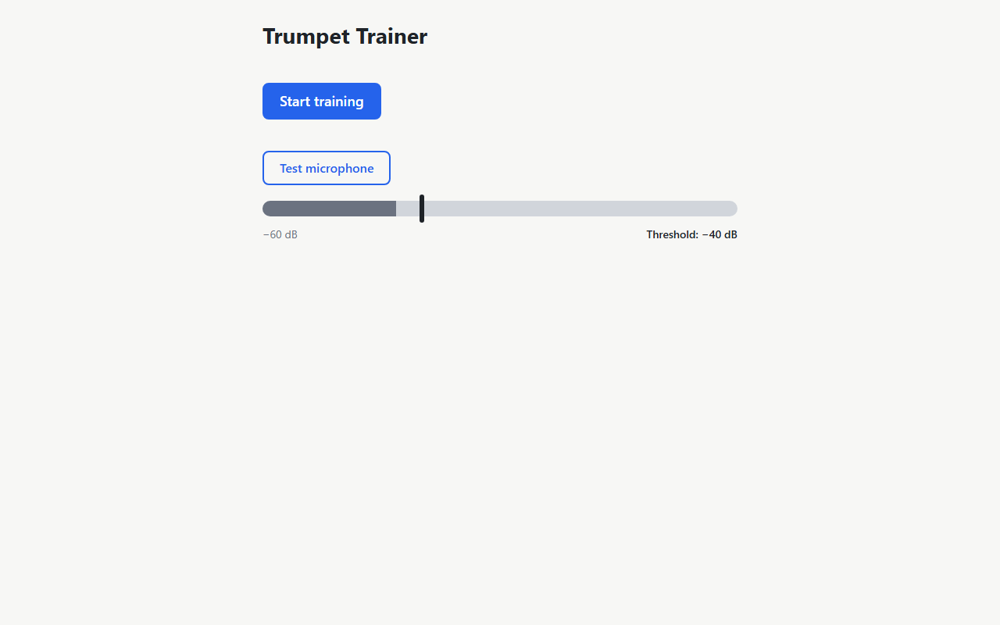

- ✅ **P2-5 Threshold slider** — Slider set to −20 → label "Threshold: −20 dB", slider value -20 (marker at 67% of the bar vs 33% before — see screenshots). Level -9 dBFS ≥ −20 → fill green: true (expected true). At 0 dB threshold, level -9 → green: false (expected false).

  

  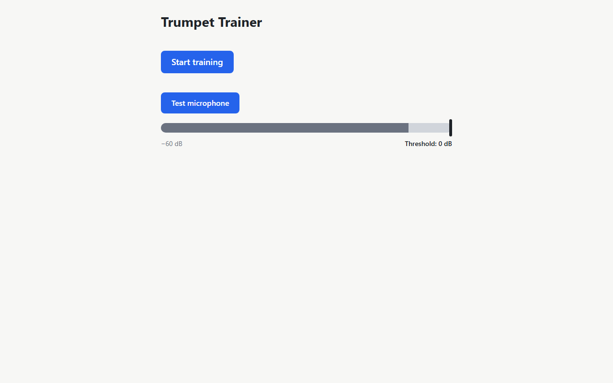

### Microphone errors

- ✅ **P2-6 Blocked microphone shows inline alert** — Alert: "Microphone access is blocked. Allow the microphone for this site (usually via the icon in the address bar or your browser's site settings), then press Start training again."; Start training enabled: true; Training screen shown: false; oscillators started (melody played): 0. Denial simulated by getUserMedia rejecting with NotAllowedError (headless Chromium has no site-settings UI).

  

- ✅ **P2-7 Allowed microphone starts training** — After allowing the microphone, Start training → alert count 0, Training screen shown with status "Listen…".

  

### Training flow

- ✅ **P2-8 Start training: playing → guard → listening** — Status sequence 120ms:"Listen…" → 2672ms:"Get ready…" → 2937ms:"Your turn: play note 1 of 5" (t=0 at click). Click → "Get ready…" 2672 ms (≈2.5 s expected), guard 265 ms (250 expected). Boxes at start: active, pending, pending, pending, pending; Repeat/Give up disabled while playing: true/true, enabled when listening: true/true. Melody oscillators (last 5): 261.6, 311.1, 277.2, 164.8, 392.0 Hz. Audibility of the 5 notes is a human-ear check.
- ✅ **P2-9 Speaker playback never turns a box green** — Proxy on 5174 with ?melody=60,62,64,65,67 (none matches the fake 440 Hz mic): through playback, guard and 3 s of listening no box turned done (done transitions: 0; boxes active, pending, pending, pending, pending). Real speaker → microphone acoustic leakage needs a human with speakers and a real mic (manual).

  

- ✅ **P2-10 Correct note turns box green and advances** — Proxy on 5174 ?melody=71,60,60,60,60 with the fake 440 Hz tone: box 1 turned done showing "Si4" 504 ms after listening started (≥500 ms sustain), highlight moved to box 2 (done, active, pending, pending, pending), status "Your turn: play note 2 of 5". Playing other notes on a real trumpet (and other spellings like Fa#3 / Si♭3) remains manual.

  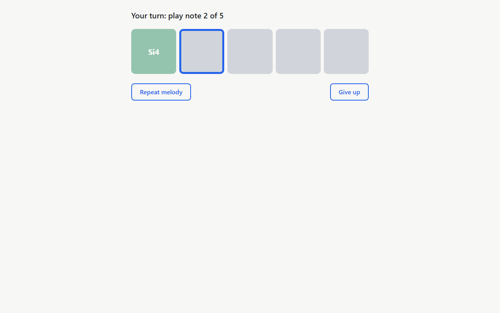

- ✅ **P2-11 Wrong note / octave off changes nothing** — Proxy on 5174 with the fake 440 Hz tone. wrong note (target written Do4 = 233 Hz concert, mic plays 440 Hz): after 3 s of listening, done transitions 0, box 1 active, status "Your turn: play note 1 of 5" → unchanged; octave off (target written Si3 = 220 Hz concert, mic plays 440 Hz — one octave above): after 3 s of listening, done transitions 0, box 1 active, status "Your turn: play note 1 of 5" → unchanged. Real trumpet wrong-note/octave checks remain manual.

  

  

- ✅ **P2-12 Repeat melody** — After box 1 done, Repeat → buttons disabled (true/true), status 2ms:"Listen…" → 2558ms:"Get ready…" → 2825ms:"Your turn: play note 2 of 5"; 5 oscillators replayed; boxes while replaying done, active, pending, pending, pending and after done, active, pending, pending, pending; mic tracks live during replay and live after; getUserMedia calls before/after: 1/1 (session kept → mic indicator stays on).

  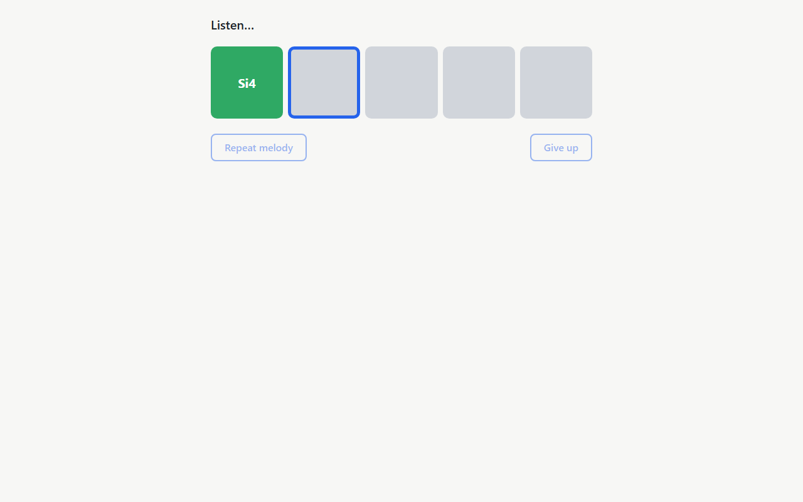

  

- ✅ **P2-13 Give up** — Home shown 3 ms after clicking Give up; mic tracks ended (released → indicator off); threshold kept: slider -20, label "Threshold: −20 dB".

  

- ✅ **P2-14 Complete all 5 notes** — Proxy on 5174 ?melody=71,71,71,71,71 with the fake 440 Hz tone: boxes done(Si4), done(Si4), done(Si4), done(Si4), done(Si4); status "Well done!"; buttons disabled true/true; Home returned 1506 ms later (≈1500 expected); mic tracks ended. Completing a random melody on a real trumpet remains manual.

  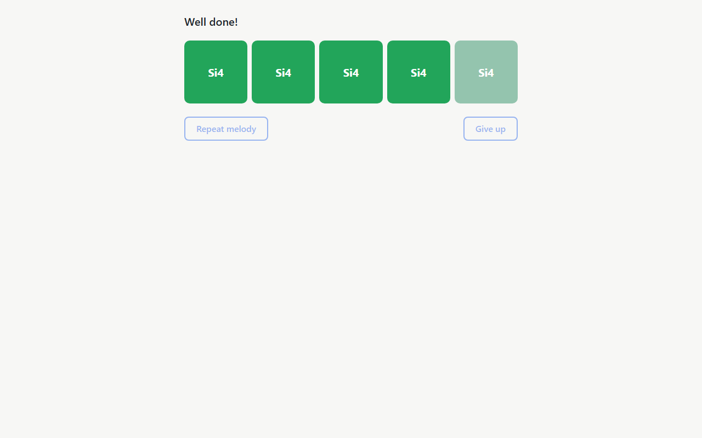

  

### Threshold gating

- ✅ **P2-15 Threshold 0 dB blocks detection** — Proxy on 5174 ?melody=71,71,71,71,71, threshold 0 dB: the matching fake 440 Hz tone (≈−9 dBFS) played for 3 s of listening and no box turned done (done transitions 0; box 1 active). A loud real trumpet remains a manual check.

  

### Deterministic mode

- ✅ **P2-16 ?melody=71,71,71,71,71 on the e2e-mode server** — Melody played as five repeated notes (440.0, 440.0, 440.0, 440.0, 440.0 Hz = concert A4); boxes turned green in order note-box-0 → note-box-1 → note-box-2 → note-box-3 → note-box-4 (gaps 533, 516, 517, 516 ms), each showing Si4; Home returned 1506 ms after "Well done!". The fake mic replaces the phone tone generator.
  - Output: [17-deterministic-run.json](run-3/output/17-deterministic-run.json)

  

  

- ✅ **P2-17 ?melody ignored on dev and production preview** — Synth oscillator frequencies recorded via an init script: dev-5173: played 440.0, 233.1, 233.1, 392.0, 370.0 Hz (random, not the 71×5 param); preview-4173: played 277.2, 329.6, 196.0, 370.0, 440.0 Hz (random, not the 71×5 param). (?melody=71,71,71,71,71 would be five 440 Hz notes; the chance of a random melody being that is (1/19)^5.)

  

  

### CI/CD

- ✅ **P2-18 ci.yml review** — All 16 ci.yml expectations met (triggers, Node 22, check/e2e/deploy jobs, Pages deploy of dist).
  - Output: [08-ci-yml-check.txt](run-3/output/08-ci-yml-check.txt)
- ⏭️ SKIP **P2-19 GitHub Pages deployment** — Manual: needs GitHub repo settings (Pages source "GitHub Actions", main or DEPLOY_BRANCH) and a push. Remote: https://github.com/fer5899/trumpet-trainer.git; current branch: create-mvp.
  - Output: [09-git-remote.txt](run-3/output/09-git-remote.txt)

# Appendix checks

## Appendix A: Re-validation after /t-review #1 (validation.md steps 20–32)

### Warnings

- ✅ **A-20 Start / Test microphone race: toggle disabled while Start is pending, stays off after Give up** — getUserMedia held open by an init script (simulated permission prompt). While pending: "Test microphone" disabled: true, Start disabled: true; forced click → clicked, aria-pressed stayed "false"; getUserMedia calls: 1. After releasing the mic → training (Give up enabled: true) → Give up → 3 s on Home: toggle aria-pressed="false", enabled: true; meter aria-valuenow=-60 (min -60); getUserMedia calls on arrival / after 3 s: 1/1 (no new request); mic tracks ended (indicator off); page errors: 0. The real browser permission prompt and OS indicator stay a manual check.
  - Output: [23-a20-start-race.json](run-3/output/23-a20-start-race.json)

  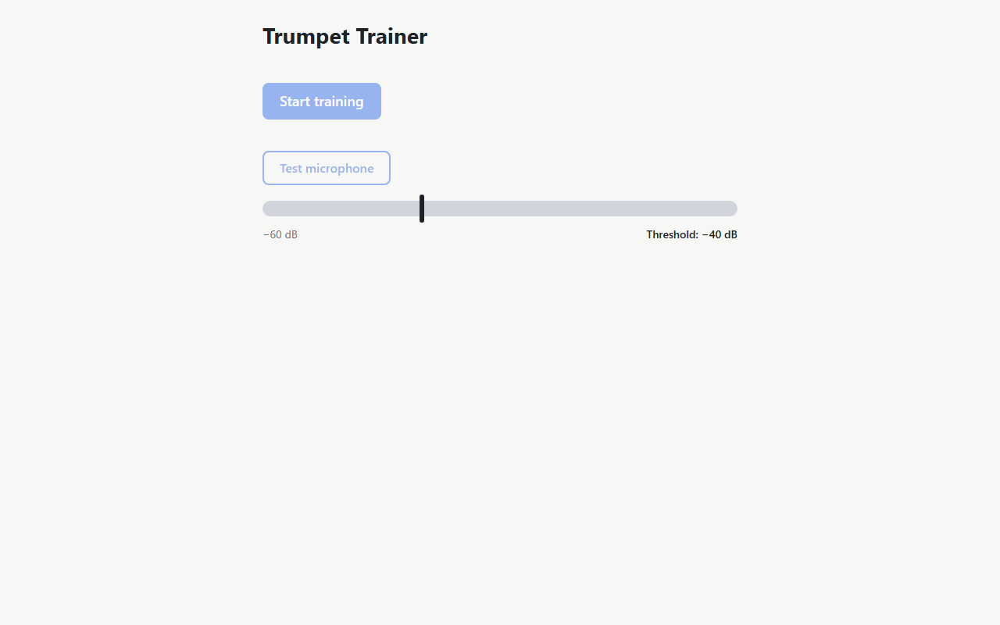

  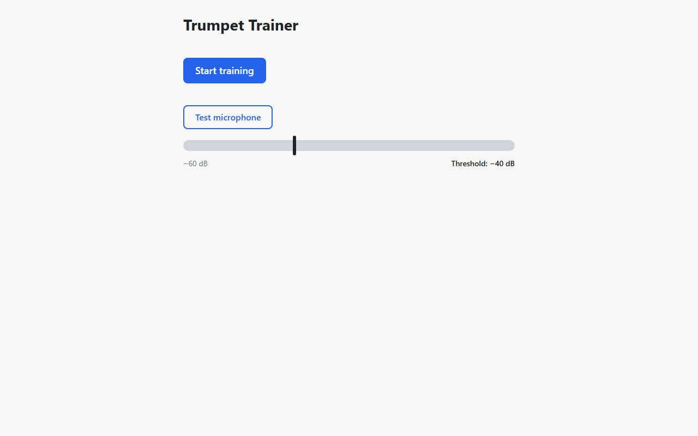

- ✅ **A-21 No Web Audio: "unsupported" alert, no uncaught errors** — Unit: `npx vitest run src/audio/audioContext.test.ts src/audio/services.test.ts`: exit 0, 14 tests, 0 failed; "without Web Audio support": passed; "rejects (never throws synchronously) with "unsupported"": passed. Browser: Expected text (micErrorMessage('unsupported')): "This browser can't access the microphone. Use an up-to-date Chrome, Firefox, Safari or Edge over HTTPS.". [console] Test microphone → alerts ["unsupported message"], toggle pressed "false"; reload + Start training → alerts ["unsupported message"], Start enabled true, training screen false; unhandled rejections 0, uncaught errors 0, console errors 0 → ok; [init-script] Test microphone → alerts ["unsupported message"], toggle pressed "false"; reload + Start training → alerts ["unsupported message"], Start enabled true, training screen false; unhandled rejections 0, uncaught errors 0, console errors 0 → ok.
  - Output: [19-vitest-audiocontext-services.txt](run-3/output/19-vitest-audiocontext-services.txt), [24-a21-no-webaudio.json](run-3/output/24-a21-no-webaudio.json)

  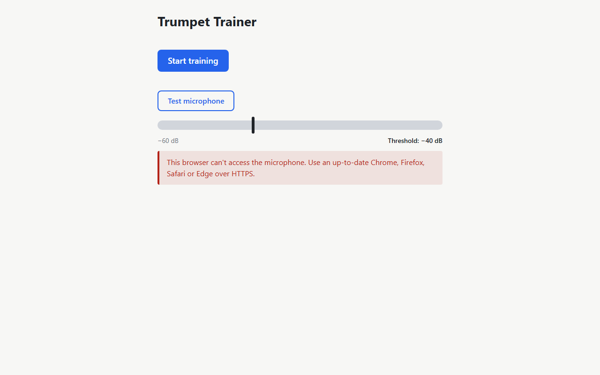

  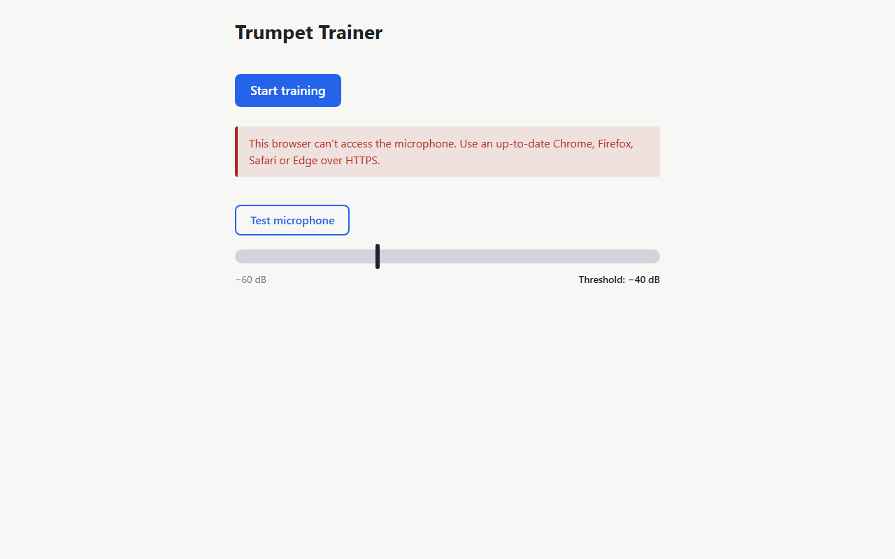

### Suggestions

- ✅ **A-22 Meter re-renders only when the displayed level changes** — Unit: `npx vitest run src/components/MicLevelMeter.test.tsx`: exit 0, 6 tests, 0 failed; "re-renders only when the displayed (rounded, clamped) level changes": passed. Browser: Browser proxy: with the steady fake 440 Hz tone (aria-valuenow -9 dBFS), the meter's DOM changed 4 time(s) over 3 s while 180 animation frames ran (pass if < 60); values seen while observing: -10, -9. The React DevTools Profiler commit count itself is a manual check.
  - Output: [20-vitest-miclevelmeter.txt](run-3/output/20-vitest-miclevelmeter.txt), [25-a22-meter-mutations.json](run-3/output/25-a22-meter-mutations.json)

  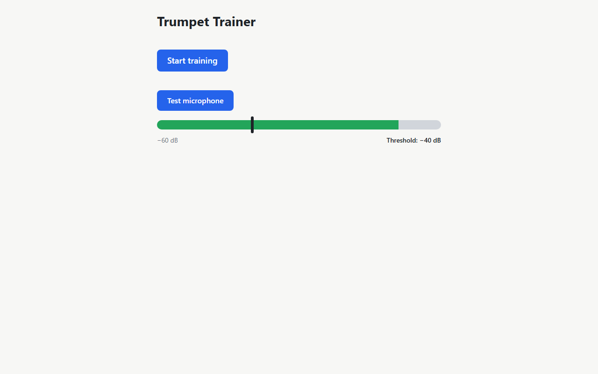

- ✅ **A-23 Frame loop survives a throwing listener** — `npx vitest run src/audio/microphone.test.ts`: exit 0, 22 tests, 0 failed; "keeps the frame loop running when a listener throws": passed. (The test asserts the error propagates, the next animation frame is still requested and listeners keep receiving frames.)
  - Output: [21-vitest-microphone.txt](run-3/output/21-vitest-microphone.txt)
- ✅ **A-24 One reused frame object; subscribe/unsubscribe during a frame** — Unit: `npx vitest run src/audio/microphone.test.ts`: exit 0, 22 tests, 0 failed; "reuses one frame object across frames (no per-frame allocation)": passed; "a listener subscribed or unsubscribed during a frame takes effect from the next frame": passed. Browser: prd.md step 12 repeated as P1-12 (PASS): getUserMedia called once; 92 frames in 1.5 s at 48000 Hz; levels finite in [−100, 0] dBFS: true (range -100.0…-9.0).
  - Output: [21-vitest-microphone.txt](run-3/output/21-vitest-microphone.txt), [15-mic-frames.json](run-3/output/15-mic-frames.json)
- ✅ **A-25 Blocked microphone: a single alert** — Denial simulated (getUserMedia rejects with NotAllowedError). After "Test microphone": 1 alert(s) — inside the meter section: true, below the meter (top 322 ≥ meter bottom 277): true. After "Start training": 1 alert(s) on the page — text is the 'permission-denied' message: true, outside the meter: true, after the Start button in DOM order: true, below it (top 181 ≥ 153): true; the meter's earlier alert is gone: true.
  - Output: [26-a25-alerts.json](run-3/output/26-a25-alerts.json)

  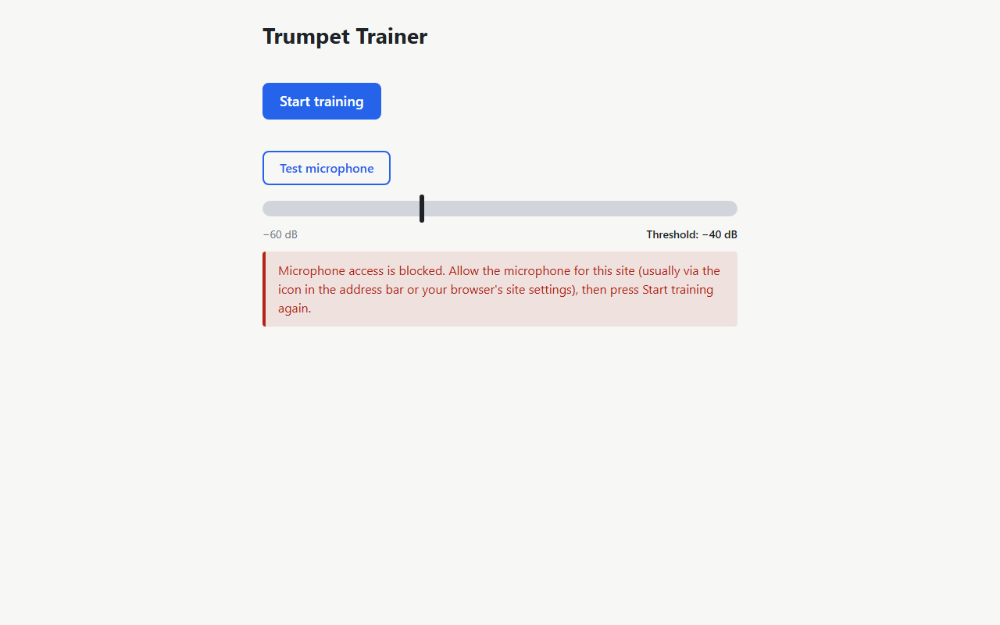

  

- ✅ **A-26 Components declare `: JSX.Element`** — 6/6 exported components declare `: JSX.Element` (App: JSX.Element, HomeScreen: JSX.Element, MicLevelMeter: JSX.Element, TrainingScreen: JSX.Element, NoteBox: JSX.Element, AudioServicesProvider: JSX.Element); `npm run typecheck` exit 0, clean.
  - Output: [03-typecheck.txt](run-3/output/03-typecheck.txt), [22-static-checks.txt](run-3/output/22-static-checks.txt)
- ✅ **A-27 Session test helpers only in sessionDriver.ts** — sessionDriver.ts defines FRAME_MS, LOUD_DB, concertHz, finishPlayback, elapse, toListening, hold; other definitions under src/: none; createSessionDriver used by appTestUtils.tsx: true, useTrainingSession.test.tsx: true. Thin one-line delegates kept in the hook test: finishPlayback, elapse, toListening, hold (they call driver.* and do not re-implement anything).
  - Output: [22-static-checks.txt](run-3/output/22-static-checks.txt)
- ✅ **A-28 `boxStates` uses `Array.from({ length: MELODY_LENGTH }, …)`** — `boxStates` built with `Array.from({ length: MELODY_LENGTH }, …)`: true; hard-coded `[0, 1, 2, 3, 4]` present: false.
  - Output: [22-static-checks.txt](run-3/output/22-static-checks.txt)
- ✅ **A-29 `renderApp` no longer returns `user`** — renderApp returns {...utils, ...createSessionDriver(fake), fake, click, startTraining: () => click('Start training'),} — `user` returned: false; `userEvent.setup(…)` still used internally: true, by `click` (`user.click`): true.
  - Output: [22-static-checks.txt](run-3/output/22-static-checks.txt)
- ✅ **A-30 implementation-notes.md records the component-test deviation** — "Tech-debt fixes (/t-review #1)" records the missing HomeScreen.test.tsx / TrainingScreen.test.tsx as an intentional deviation covered by src/components/App.test.tsx.
  - Output: [22-static-checks.txt](run-3/output/22-static-checks.txt)
- ✅ **A-31 ci.yml top-level least-privilege permissions** — Top-level `permissions:` before `jobs:`: { contents: read } (contents: read: true, any write: false); deploy job block: { pages: write id-token: write contents: read } — pages: write, id-token: write, contents: read all present.
  - Output: [22-static-checks.txt](run-3/output/22-static-checks.txt)

### Regression

- ✅ **A-32 Full regression: commands + every original check** — npm test: ok (21 test files / 320 tests (320 passed, 0 failed), exit 0); npm run lint: ok (lint exit 0, clean); npm run typecheck: ok (typecheck exit 0, clean); npm run build: ok (build exit 0); npm run test:e2e: ok (test:e2e exit 0, 3 passed / 0 failed). Original checks: 31 passed, 0 failed, 1 skipped (P2-19 — manual). Expected counts: 21 files / 320 tests, 3 Playwright specs.
  - Output: [01-npm-test.txt](run-3/output/01-npm-test.txt), [02-lint.txt](run-3/output/02-lint.txt), [03-typecheck.txt](run-3/output/03-typecheck.txt), [18-build.txt](run-3/output/18-build.txt), [04-test-e2e.txt](run-3/output/04-test-e2e.txt)

# Comparison with previous run (Run 2)

**No regressions:** every original check that passed in Run 2 still passes.

| Check | Run 2 | Run 3 | Change |
|---|---|---|---|
| P1-1 Unit tests (`npm test`) | PASS | PASS | unchanged |
| P1-2 Lint and typecheck | PASS | PASS | unchanged |
| P1-3 E2E (`npm run test:e2e`) | PASS | PASS | unchanged |
| P1-4 tsconfig strict | PASS | PASS | unchanged |
| P1-5 Dev server renders the app shell | PASS | PASS | unchanged |
| P1-6 Production preview under /trumpet-trainer/ | PASS | PASS | unchanged |
| P1-7 Constants match the PRD table | PASS | PASS | unchanged |
| P1-8 Music tests incl. 7 spelling worked examples | PASS | PASS | unchanged |
| P1-9 Audio + training tests | PASS | PASS | unchanged |
| P1-10 Fake-mic fixture WAV | PASS | PASS | unchanged |
| P1-11 Synth playback in a real browser | PASS | PASS | unchanged |
| P1-12 Microphone frames + pitch detection in a real browser | PASS | PASS | unchanged |
| P1-13 Denied microphone maps to permission-denied | PASS | PASS | unchanged |
| P2-1 npm test / lint / typecheck | PASS | PASS | unchanged |
| P2-2 Playwright e2e specs | PASS | PASS | unchanged |
| P2-3 Home screen initial state | PASS | PASS | unchanged |
| P2-4 Test microphone toggle and level meter | PASS | PASS | unchanged |
| P2-5 Threshold slider | PASS | PASS | unchanged |
| P2-6 Blocked microphone shows inline alert | PASS | PASS | unchanged |
| P2-7 Allowed microphone starts training | PASS | PASS | unchanged |
| P2-8 Start training: playing → guard → listening | PASS | PASS | unchanged |
| P2-9 Speaker playback never turns a box green | PASS | PASS | unchanged |
| P2-10 Correct note turns box green and advances | PASS | PASS | unchanged |
| P2-11 Wrong note / octave off changes nothing | PASS | PASS | unchanged |
| P2-12 Repeat melody | PASS | PASS | unchanged |
| P2-13 Give up | PASS | PASS | unchanged |
| P2-14 Complete all 5 notes | PASS | PASS | unchanged |
| P2-15 Threshold 0 dB blocks detection | PASS | PASS | unchanged |
| P2-16 ?melody=71,71,71,71,71 on the e2e-mode server | PASS | PASS | unchanged |
| P2-17 ?melody ignored on dev and production preview | PASS | PASS | unchanged |
| P2-18 ci.yml review | PASS | PASS | unchanged |
| P2-19 GitHub Pages deployment | SKIP | SKIP | unchanged |

Appendix checks (A-20…A-32) are new in Run 3 and have no Run 2 status.
