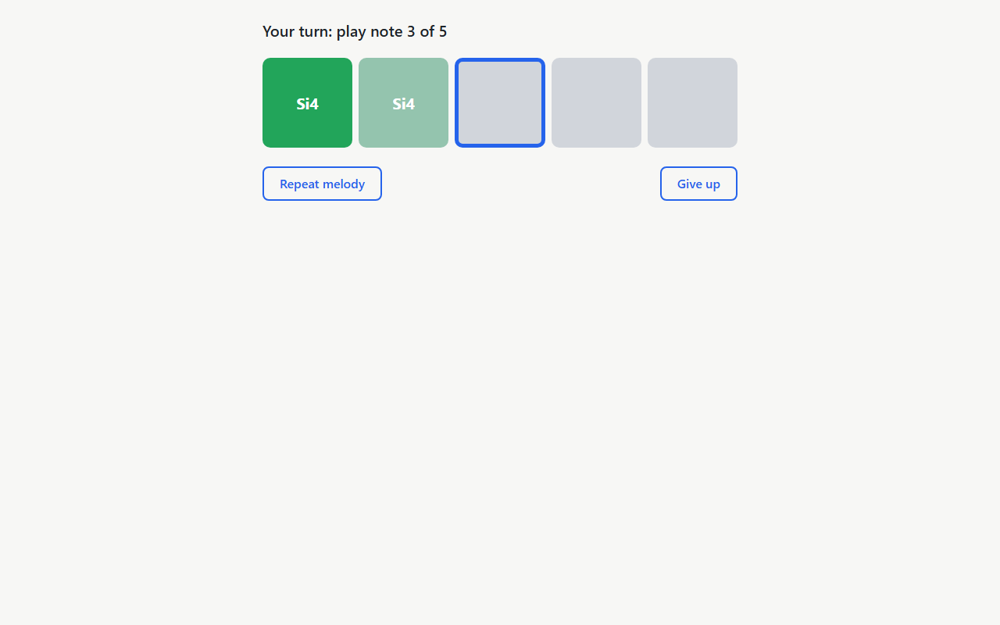

# Validation Report — Run 1

**Date:** 2026-10-08 17:54:02 UTC  
**Branch:** in-app-configuration @ 35fc549  
**Checklist:** [validation.md](../validation.md) (in-app configuration, Part 1 / prd.md)  
**Scripts:** `specs/in-app-configuration/validation-run-1/run.sh` + `validate.mjs` (Playwright Chromium, fake mic = 440 Hz tone, dev server in e2e mode)

**Summary:** 16 passed, 0 failed, 0 skipped

## Constants

- ✅ **1. Removed and new constants** — Got `[undefined,undefined,undefined,1000,0.5,"major:do"]`
  Evidence: [01-constants.json](run-1/api/01-constants.json)

## Scale catalog

- ✅ **2. SCALE_OPTIONS has 146 options** — Got `146`
  Evidence: [02-scale-options-length.json](run-1/api/02-scale-options-length.json)

- ✅ **3. First 11 option names (chromatic + 10 groups)** — Got `["Chromatic","All scales","All majors","All natural minors","All dorian","All phrygian","All lydian","All mixolydian","All locrian","All major pentatonics","All minor pentatonics"]`
  Evidence: [03-first-11-names.json](run-1/api/03-first-11-names.json)

- ✅ **4. Locrian tonic names in key-signature order** — Got `"Si Fa# Do# Sol# Re# La# Mi# Si# Mi La Re Sol Do Fa Si♭"`
  Evidence: [04-locrian-tonics.json](run-1/api/04-locrian-tonics.json)

- ✅ **5. searchScaleOptions (English letters, b/#)** — Got `[["Si♭ major","Si♭ major pentatonic"],["Fa# dorian"]]`
  Evidence: [05-search.json](run-1/api/05-search.json)

- ✅ **6. minMaxInterval for chromatic / major / pentatonic group / all** — Got `[1,2,3,3]`
  Evidence: [06-min-max-interval.json](run-1/api/06-min-max-interval.json)

## Spelling in key

- ✅ **7. spellInKey (Si#3, Mi#4, Do♭5)** — Got `[["Si#3","Mi#4","Do#4"],["Sol♭4","Do♭5","Si♭4"]]`
  Evidence: [07-spell-in-key.json](run-1/api/07-spell-in-key.json)

## Exercise generator

- ✅ **8. generateExercise worked example (scripted rng)** — Got `[[55,62,72],"major:do"]`
  Evidence: [08-generate-exercise-worked-example.json](run-1/api/08-generate-exercise-worked-example.json)

- ✅ **9. Random group:major exercises fit their key, steps ≤ 2** — Exact expression: `major:mi Fa#4 Sol#4 La4 Sol#4 Sol#4 La4 La4 Sol#4`, `major:do-flat Do♭4 Si♭3 Si♭3 Si♭3 Si♭3 Si♭3 Do♭4 Do♭4`, `major:do-flat Do♭4 Do♭4 Do♭4 Si♭3 La♭3 Si♭3 Do♭4 Re♭4`, `major:re Si4 Si4 Si4 La4 Sol4 La4 Sol4 Fa#4`, `major:mi-flat La♭3 Si♭3 Do4 Si♭3 Si♭3 Si♭3 La♭3 La♭3`. A second sample of 5 checked note by note: scale is major, 8 notes, pitch classes in the scale, |step| ≤ 2, every accidental matches keySignatureAlters and every name maps back to its MIDI number.
  Evidence: [09-group-major-melodies.txt](run-1/api/09-group-major-melodies.txt), [09-group-major-check.json](run-1/api/09-group-major-check.json)

## Settings model and storage

- ✅ **10. normalizeSettings field-by-field validation** — Got `{"noteDurationMs":750,"melodyLength":5,"volume":0.5,"maxInterval":12,"scaleId":"major:fa"}`
  Evidence: [10-normalize-settings.json](run-1/api/10-normalize-settings.json)

- ✅ **11. Storage adapter round-trip across a reload** — After page.reload(): `[7,-35]` (expected `[7,-35]`). Raw stored: `{"noteDurationMs":1000,"melodyLength":7,"volume":0.5,"maxInterval":12,"scaleId":"major:do"}`, `-35`.
  Evidence: [11-storage-round-trip.json](run-1/api/11-storage-round-trip.json)

- ✅ **12. Invalid stored JSON falls back to defaults** — Returned `{"noteDurationMs":1000,"melodyLength":5,"volume":0.5,"maxInterval":12,"scaleId":"major:do"}` without throwing; localStorage cleared (length 0).
  Evidence: [12-invalid-json-defaults.json](run-1/api/12-invalid-json-defaults.json)

## Synth volume and playback (app still works)

- ✅ **13. Start training plays a 5-note melody, 1 s per note, master 0.5** — Status "Listen…", 5 note boxes. Oscillator starts at 0.071, 1.071, 2.071, 3.071, 4.071 s (spacing 1.000, 1.000, 1.000, 1.000 s), note durations 1.000, 1.000, 1.000, 1.000, 1.000 s, frequencies 233.1, 164.8, 293.7, 329.6, 415.3 Hz, master gain initial 0.5, envelope peaks 1, 1, 1, 1, 1; 2 playSequence call(s) logged (StrictMode may start and stop one extra), the last 5-note one is analysed. Loudness vs v0.1.0 / no clicks or distortion: manual ear check.
  Evidence: [13-start-training-audio-log.json](run-1/api/13-start-training-audio-log.json)

  

  

  

- ✅ **14. ?melody=71,71,71,71,71 completes with the fake mic** — All 5 boxes data-state="done" with names Si4, Si4, Si4, Si4, Si4; status "Well done!"; then back on Home. Server e2e mode (VITE_E2E): true. Real trumpet: manual.

  

  

  

  

  

- ✅ **15. setVolume mid-melody ramps the master gain** — AudioContext "running". linearRampToValueAtTime(1) issued 2.000 s after playSequence (ctx 2.000 s), ramp length 20.0 ms (expected 20 ms), preceded by cancelScheduledValues + setValueAtTime(0.200); master initial gain 0.2; note starts 0.050, 1.050, 2.050, 3.050, 4.050 s. Audible smoothness (no click): manual.
  Evidence: [15-set-volume-audio-log.json](run-1/api/15-set-volume-audio-log.json)

## Regression

- ✅ **16. lint, typecheck, unit tests, e2e** — `npm run lint` exit 0, `npm run typecheck` exit 0, `npm test` exit 0, `npm run test:e2e` exit 0. Unit tests: 1027 passed, 0 failed (files: 24 passed (24)). E2E: 3 passed, 0 failed.
  Evidence: [16-lint.txt](run-1/output/16-lint.txt), [16-typecheck.txt](run-1/output/16-typecheck.txt), [16-unit-tests.txt](run-1/output/16-unit-tests.txt), [16-e2e.txt](run-1/output/16-e2e.txt)

## Manual follow-up

These need a human with speakers (and, for the last one, a trumpet); the script only verifies the scheduling behind them:

- **13 — Loudness:** the melody is noticeably louder than the v0.1.0 MVP (master 0.5 × envelope peak 1 vs 1 × 0.25).
- **13 — No clicks or distortion** at note starts/ends with the higher envelope peak.
- **15 — Smooth volume jump:** from ~2 s the volume rises mid-melody without an audible click (20 ms master ramp).
- **14 — Real trumpet:** playing written Si4 (concert A4) in tune and holding it turns each box green, as in the MVP.
