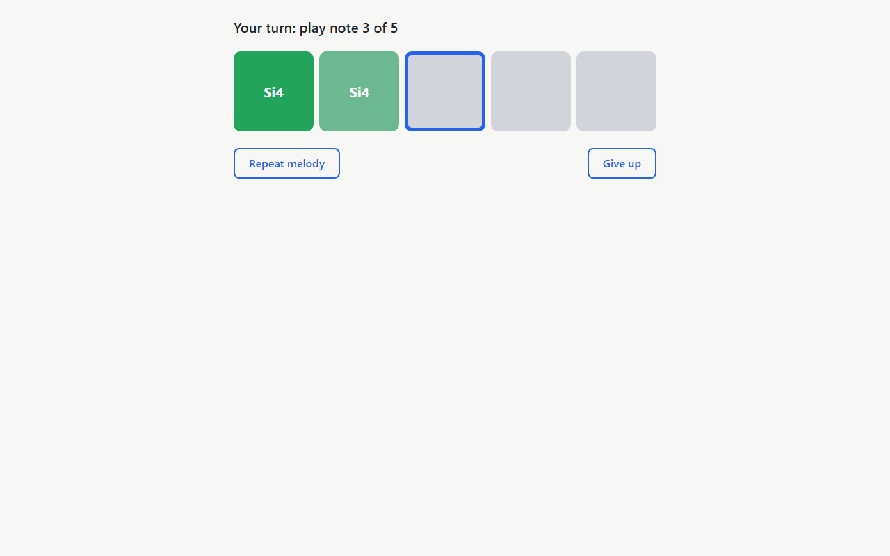
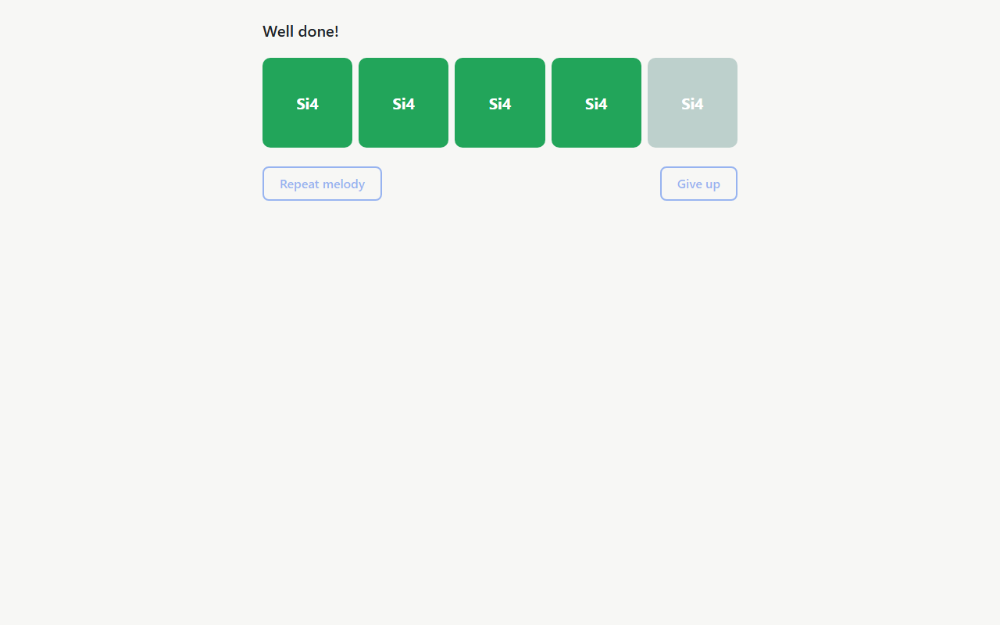

# Validation Report — Run 2 (post /t-review #1)

**Date:** 2026-10-08 18:44:52 UTC  
**Branch:** in-app-configuration @ 35fc549  
**Checklist:** [validation.md](../validation.md) (in-app configuration, Part 1 / prd.md, items 1–16 + Appendix A items 17–27)  
**Previous run:** [validation-report-run-1.md](validation-report-run-1.md)  
**Scripts:** `specs/in-app-configuration/validation-run-2/run.sh` + `validate.mjs` (Playwright Chromium, fake mic = 440 Hz tone, dev server in e2e mode)

**Summary:** 27 passed, 0 failed, 0 skipped

## Re-run of original checks

### Constants

- ✅ **1. Removed and new constants** — Got `[undefined,undefined,undefined,1000,0.5,"major:do"]`
  Evidence: [01-constants.json](run-2/api/01-constants.json)

### Scale catalog

- ✅ **2. SCALE_OPTIONS has 146 options** — Got `146`
  Evidence: [02-scale-options-length.json](run-2/api/02-scale-options-length.json)

- ✅ **3. First 11 option names (chromatic + 10 groups)** — Got `["Chromatic","All scales","All majors","All natural minors","All dorian","All phrygian","All lydian","All mixolydian","All locrian","All major pentatonics","All minor pentatonics"]`
  Evidence: [03-first-11-names.json](run-2/api/03-first-11-names.json)

- ✅ **4. Locrian tonic names in key-signature order** — Got `"Si Fa# Do# Sol# Re# La# Mi# Si# Mi La Re Sol Do Fa Si♭"`
  Evidence: [04-locrian-tonics.json](run-2/api/04-locrian-tonics.json)

- ✅ **5. searchScaleOptions (English letters, b/#)** — Got `[["Si♭ major","Si♭ major pentatonic"],["Fa# dorian"]]`
  Evidence: [05-search.json](run-2/api/05-search.json)

- ✅ **6. minMaxInterval for chromatic / major / pentatonic group / all** — Got `[1,2,3,3]`
  Evidence: [06-min-max-interval.json](run-2/api/06-min-max-interval.json)

### Spelling in key

- ✅ **7. spellInKey (Si#3, Mi#4, Do♭5)** — Got `[["Si#3","Mi#4","Do#4"],["Sol♭4","Do♭5","Si♭4"]]`
  Evidence: [07-spell-in-key.json](run-2/api/07-spell-in-key.json)

### Exercise generator

- ✅ **8. generateExercise worked example (scripted rng)** — Got `[[55,62,72],"major:do"]`
  Evidence: [08-generate-exercise-worked-example.json](run-2/api/08-generate-exercise-worked-example.json)

- ✅ **9. Random group:major exercises fit their key, steps ≤ 2** — Exact expression: `major:si Do#4 Re#4 Do#4 Si3 Si3 Si3 Do#4 Re#4`, `major:do Re4 Mi4 Re4 Do4 Re4 Do4 Do4 Re4`, `major:si-flat Re4 Re4 Mi♭4 Re4 Re4 Do4 Do4 Do4`, `major:sol Sol4 Sol4 Sol4 La4 La4 Si4 Do5 Si4`, `major:re Sol4 Sol4 Fa#4 Sol4 Sol4 La4 Sol4 Sol4`. A second sample of 5 checked note by note: scale is major, 8 notes, pitch classes in the scale, |step| ≤ 2, every accidental matches keySignatureAlters and every name maps back to its MIDI number.
  Evidence: [09-group-major-melodies.txt](run-2/api/09-group-major-melodies.txt), [09-group-major-check.json](run-2/api/09-group-major-check.json)

### Settings model and storage

- ✅ **10. normalizeSettings field-by-field validation** — Got `{"noteDurationMs":750,"melodyLength":5,"volume":0.5,"maxInterval":12,"scaleId":"major:fa"}`
  Evidence: [10-normalize-settings.json](run-2/api/10-normalize-settings.json)

- ✅ **11. Storage adapter round-trip across a reload** — After page.reload(): `[7,-35]` (expected `[7,-35]`). Raw stored: `{"noteDurationMs":1000,"melodyLength":7,"volume":0.5,"maxInterval":12,"scaleId":"major:do"}`, `-35`.
  Evidence: [11-storage-round-trip.json](run-2/api/11-storage-round-trip.json)

- ✅ **12. Invalid stored JSON falls back to defaults** — Returned `{"noteDurationMs":1000,"melodyLength":5,"volume":0.5,"maxInterval":12,"scaleId":"major:do"}` without throwing; localStorage cleared (length 0).
  Evidence: [12-invalid-json-defaults.json](run-2/api/12-invalid-json-defaults.json)

### Synth volume and playback (app still works)

- ✅ **13. Start training plays a 5-note melody, 1 s per note, master 0.5** — Status "Listen…", 5 note boxes. Oscillator starts at 0.071, 1.071, 2.071, 3.071, 4.071 s (spacing 1.000, 1.000, 1.000, 1.000 s), note durations 1.000, 1.000, 1.000, 1.000, 1.000 s, frequencies 329.6, 311.1, 415.3, 329.6, 329.6 Hz, master gain initial 0.5, envelope peaks 1, 1, 1, 1, 1; 2 playSequence call(s) logged (StrictMode may start and stop one extra), the last 5-note one is analysed. Loudness vs v0.1.0 / no clicks or distortion: manual ear check.
  Evidence: [13-start-training-audio-log.json](run-2/api/13-start-training-audio-log.json)

  

  

  

- ✅ **14. ?melody=71,71,71,71,71 completes with the fake mic** — All 5 boxes data-state="done" with names Si4, Si4, Si4, Si4, Si4; status "Well done!"; then back on Home. Server e2e mode (VITE_E2E): true. Real trumpet: manual.

  

  

  

  

  

- ✅ **15. setVolume mid-melody ramps the master gain** — AudioContext "running". linearRampToValueAtTime(1) issued 2.011 s after playSequence (ctx 2.011 s), ramp length 20.0 ms (expected 20 ms), preceded by cancelScheduledValues + setValueAtTime(0.200); master initial gain 0.2; note starts 0.050, 1.050, 2.050, 3.050, 4.050 s. Audible smoothness (no click): manual.
  Evidence: [15-set-volume-audio-log.json](run-2/api/15-set-volume-audio-log.json)

### Regression

- ✅ **16. lint, typecheck, unit tests (1196), e2e (3)** — `npm run lint` exit 0, `npm run typecheck` exit 0, `npm test` exit 0, `npm run test:e2e` exit 0. Unit tests: 1196 passed, 0 failed, total 1196 (expected 1196; files: 24 passed (24)). E2E: 3 passed, 0 failed.
  Evidence: [16-lint.txt](run-2/output/16-lint.txt), [16-typecheck.txt](run-2/output/16-typecheck.txt), [16-unit-tests.txt](run-2/output/16-unit-tests.txt), [16-e2e.txt](run-2/output/16-e2e.txt)

## Appendix checks

Appendix A of validation.md: re-validation after /t-review #1.

- ✅ **17. DEFAULT_SETTINGS scale id is valid and maxInterval ≥ its minimum** — Got `[true,true]`
  Evidence: [17-default-settings.json](run-2/api/17-default-settings.json)

- ✅ **18. getSpecificScale only returns specific scales; no duplicated scaleById** — Literal validation.md expression gives `[undefined,undefined,undefined,undefined]` — its expected 'Do major' at index 0 is a checklist error (SpecificScale has no `name`; the display name is on ScaleOption). Intent check getSpecificScale('major:do') → id|type|tonicName|option name = `"major:do|major|Do|Do major"` (expected `major:do|major|Do|Do major`); group:all / chromatic / toString → undefined: yes; `grep -rn "function scaleById" src`: no hits (59 files scanned).
  Evidence: [18-get-specific-scale.json](run-2/api/18-get-specific-scale.json), [18-grep-scaleById.txt](run-2/output/18-grep-scaleById.txt)

- ✅ **19. minMaxInterval reads the precomputed table and throws on unknown ids** — Got `[3,"throws"]`
  Evidence: [19-min-max-interval.json](run-2/api/19-min-max-interval.json)

- ✅ **20. searchScaleOptions English alias (C major, F# Dorian)** — Got `[["Do major","Do major pentatonic"],["Fa# dorian"]]`
  Evidence: [20-search-english-alias.json](run-2/api/20-search-english-alias.json)

- ✅ **21. Letter / accidental primitives live in notes.ts only** — Got `["Do Re Mi Fa Sol La Si","#","♭",""]`; grep of scales.ts / spelling.ts: 7 matching line(s), no local definition of NOTE_LETTERS / SHARP_SIGN / FLAT_SIGN / alterSign and every one used is imported from `./notes` (src/music/scales.ts imports {alterSign, FLAT_SIGN, LETTER_PITCH_CLASSES, NOTE_LETTERS, SHARP_SIGN, Alter} from './notes'; src/music/spelling.ts imports {alterSign, LETTER_PITCH_CLASSES, NOTE_LETTERS, noteName, Accidental, Alter, Melody} from './notes').
  Evidence: [21-notes-primitives.json](run-2/api/21-notes-primitives.json), [21-grep-letters-signs.txt](run-2/output/21-grep-letters-signs.txt)

- ✅ **22. normalizeSettings: off-step volume falls back to the default** — Got `[0.5,0.35]`
  Evidence: [22-normalize-volume.json](run-2/api/22-normalize-volume.json)

- ✅ **23. parseThreshold: off-step value falls back to DEFAULT_THRESHOLD_DB** — Got `[-40,-35,-59]`
  Evidence: [23-parse-threshold.json](run-2/api/23-parse-threshold.json)

- ✅ **24. searchScaleOptions ranking (name prefix, then word prefix)** — Exact expression: `[["Si major","Si major pentatonic"],["Do major","Do# major","Do♭ major"]]`. 'b major' list starts with Si major, Si major pentatonic. 'do' list (34 options): first 'Do …' option at index 0 (Do major), first dorian option at index 5 (Do# dorian) → Do-tonic first. Full list: Do major, Do# major, Do♭ major, Do# minor, Do minor, Do# dorian, Do dorian, Do# phrygian, Do phrygian, Do lydian, Do♭ lydian, Do# mixolydian, Do mixolydian, Do# locrian, Do locrian, Do major pentatonic, Do# major pentatonic, Do♭ major pentatonic, Do# minor pentatonic, Do minor pentatonic, All dorian, Re dorian, La dorian, Mi dorian, Si dorian, Fa# dorian, Sol# dorian, Re# dorian, Sol dorian, Fa dorian, Si♭ dorian, Mi♭ dorian, La♭ dorian, Re♭ dorian.
  Evidence: [24-search-ranking.json](run-2/api/24-search-ranking.json)

- ✅ **25. 135-scale spelling sweep uses scaleCandidates, no magic numbers** — Sweep test "spells every note of every scale with the letter-based octave (C4 = 60)": uses `scaleCandidates(`; hard-coded 19 / 54 / 12 literals in the block: none.
  Evidence: [25-spelling-sweep.txt](run-2/output/25-spelling-sweep.txt)

- ✅ **26. implementation-notes.md: TIMER_DRIFT_MARGIN_MS reason and release decision** — TIMER_DRIFT_MARGIN_MS mentioned in 1 line(s), reason (flaky / drift / shouldAdvanceTime / real time) present; release decision (Parts 1 and 2 in one PR, no bump.txt before Part 2) present.
  Evidence: [26-implementation-notes-excerpts.txt](run-2/output/26-implementation-notes-excerpts.txt)

- ✅ **27. Original steps 1–16 all pass with no regressions vs Run 1** — All 16 original steps (1–16) pass in Run 2 (item 16 with 1196 unit tests); 16/16 passed in Run 1 and none regressed.
  Evidence: [validation-report-run-1.md](validation-report-run-1.md)

## Comparison with previous run

No status changes: every item checked in Run 1 has the same status in Run 2.

Run 1 covered 16 item(s); new in Run 2: 17, 18, 19, 20, 21, 22, 23, 24, 25, 26, 27 (Appendix A). Item 16 now expects 1196 unit tests (Run 1: 1027).

## Manual follow-up

These need a human with speakers (and, for the last one, a trumpet); the script only verifies the scheduling behind them:

- **13 — Loudness:** the melody is noticeably louder than the v0.1.0 MVP (master 0.5 × envelope peak 1 vs 1 × 0.25).
- **13 — No clicks or distortion** at note starts/ends with the higher envelope peak.
- **15 — Smooth volume jump:** from ~2 s the volume rises mid-melody without an audible click (20 ms master ramp).
- **14 — Real trumpet:** playing written Si4 (concert A4) in tune and holding it turns each box green, as in the MVP.
