# Validation Report — Run 3 (Part 2 / prd2.md initial validation)

**Date:** 2026-10-09 17:32:35 UTC  
**Branch:** in-app-configuration @ 7ebcc3c  
**Checklist:** [validation.md](../validation.md) — "Human Validation — prd2.md", items 1–51 (item 51 re-runs Part 1 steps 1–12 and 15)  
**Previous run:** [validation-report-run-2.md](validation-report-run-2.md) (Part 1 only)  
**Scripts:** `specs/in-app-configuration/validation-run-3/run.sh` + `validate.mjs` (Playwright Chromium, fake mic = 440 Hz tone = written Si4; dev 5173, e2e-mode dev 5174, preview 4173)

**Summary:** 49 passed, 1 failed, 1 skipped

## Gear button and dialog

- ✅ **1. Gear button top-right above the title, accessible name "Settings"** — Gear at (900, 24) 44×44 px, bottom 68 ≤ title "Trumpet Trainer" top 76; right edge 944 = content column right 944 (viewport 1280, column max 40rem). aria-label "Settings", aria-haspopup "dialog", AX tree: button "Settings". No title attribute (no native hover tooltip); the accessible name comes from aria-label.
  Evidence: [01-gear.json](run-3/api/01-gear.json)

  

  

- ✅ **2. Dialog contents and defaults; no Save; scale list closed** — Modal (:modal true) titled "Settings", backdrop rgba(0, 0, 0, 0.45). Scale "Do major", Melody length "5 notes", Max interval "12 semitones", Note duration "1000 ms", Playback volume "50%". Buttons: Reset to defaults, Close (no Save). Scale combobox aria-expanded="false", 0 listbox in the DOM.
  Evidence: [02-dialog.json](run-3/api/02-dialog.json)

  

- ✅ **3. Esc closes; focus back on the gear** — Dialog closed on Esc; focus on BUTTON aria-label "Settings", :focus-visible true, outline solid 3px.
  Evidence: [03-esc-focus.json](run-3/api/03-esc-focus.json)

  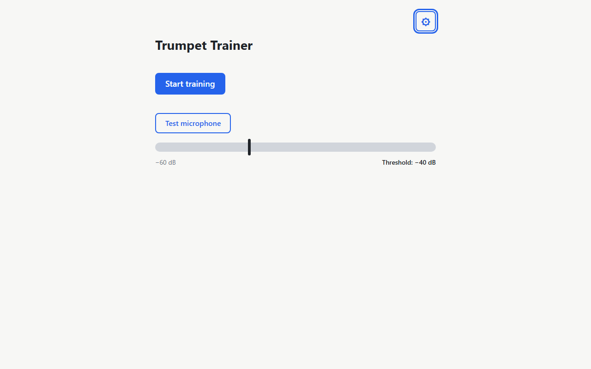

- ✅ **4. Close closes; focus back on the gear** — Dialog closed by Close; focus on BUTTON aria-label "Settings" (:focus-visible false — after a mouse click Chromium may not show the ring).

  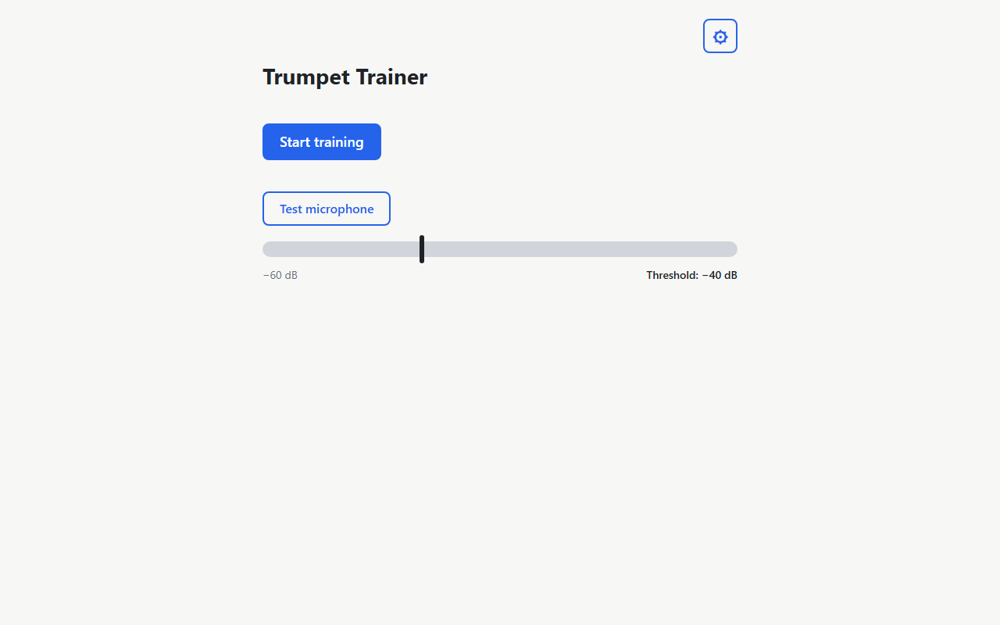

- ✅ **5. Click on the dimmed backdrop keeps the dialog open** — Clicked (5, 5) outside the dialog rect (x 384–896, y 120–680); after 500 ms the dialog is still open.

  

- ❌ **6. Tab cycles inside the dialog** — Problems: focus dropped to `<body>` after Scale (one extra Tab needed; the focus ring disappears; no focusin event fires) — likely the focus move targets the scale list (a scrollable `<ul>`, keyboard-focusable in Chromium), which unmounts on the input's blur. Initial focus: (dialog). 16 × Tab: Scale → (body) → Melody length → Max interval → Note duration → Playback volume → Reset to defaults → Close → (body) → Scale → (body) → Melody length → Max interval → Note duration → Playback volume → Reset to defaults. Never on an element behind the dialog. 3 stop(s) on body/dialog itself (Chromium moves focus out to the browser chrome / document between cycles; no page element behind the dialog receives focus).
  Evidence: [06-tab-sequence.json](run-3/api/06-tab-sequence.json)

  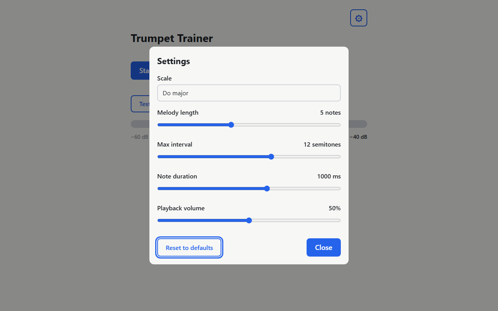

- ✅ **7. Start / Test microphone / gear disabled while the mic permission is pending** — Browser permission prompt simulated by an init script delaying getUserMedia by 2 s (the fake-UI flag auto-accepts the real prompt). Right after the click: Start disabled true, Test microphone disabled true, gear disabled true; still disabled 1 s later. Training screen shown → gear disabled false. The real prompt UI itself: manual.
  Evidence: [07-permission-pending.json](run-3/api/07-permission-pending.json)

  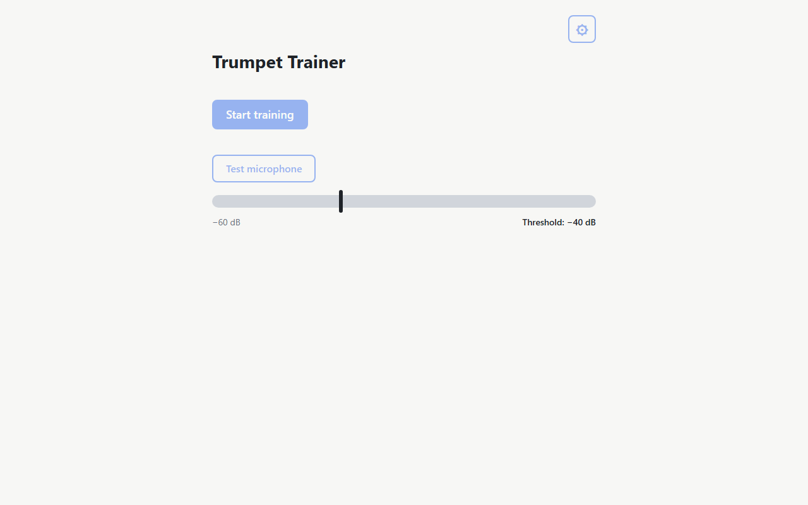

  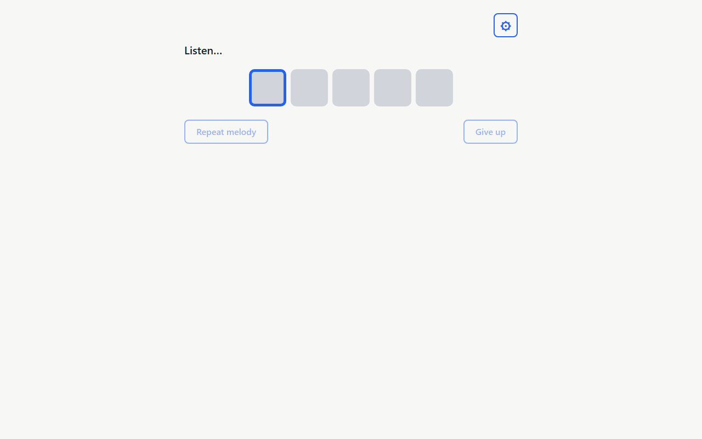

## Sliders (Home mode)

- ✅ **8. Melody length: 3 notes … 8 notes, step 1** — min 3, max 8, step 1. Home → "3 notes", End → "8 notes"; ArrowRight sweep (6 values): 3 notes, 4 notes, 5 notes, 6 notes, 7 notes, 8 notes; aria-valuetext equals the visible text at every step. (Keyboard stepping stands in for dragging: both set the same input value.)
  Evidence: [8-melody-length-sweep.json](run-3/api/8-melody-length-sweep.json)

  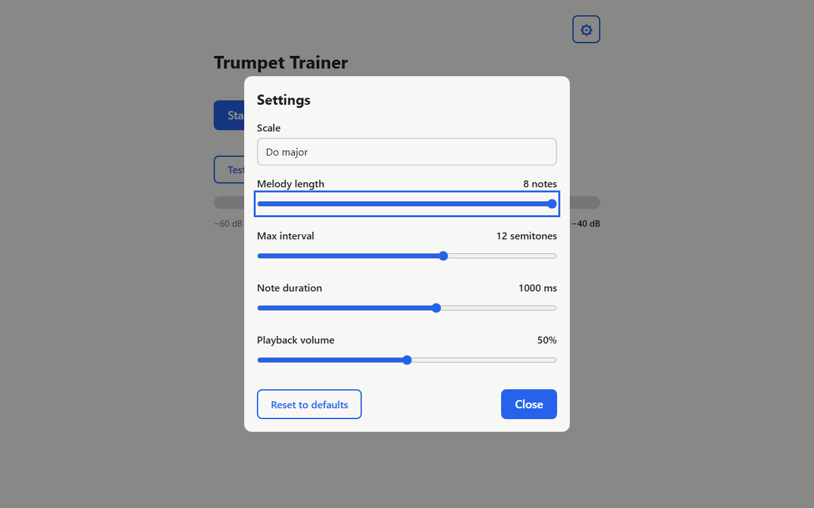

- ✅ **9. Note duration: 250 ms … 1500 ms, step 50** — min 250, max 1500, step 50. Home → "250 ms", End → "1500 ms"; ArrowRight sweep (26 values): 250 ms, 300 ms, 350 ms, 400 ms, 450 ms, 500 ms, 550 ms, 600 ms, 650 ms, 700 ms, 750 ms, 800 ms, 850 ms, 900 ms, 950 ms, 1000 ms, 1050 ms, 1100 ms, 1150 ms, 1200 ms, 1250 ms, 1300 ms, 1350 ms, 1400 ms, 1450 ms, 1500 ms; aria-valuetext equals the visible text at every step. (Keyboard stepping stands in for dragging: both set the same input value.)
  Evidence: [9-note-duration-sweep.json](run-3/api/9-note-duration-sweep.json)

  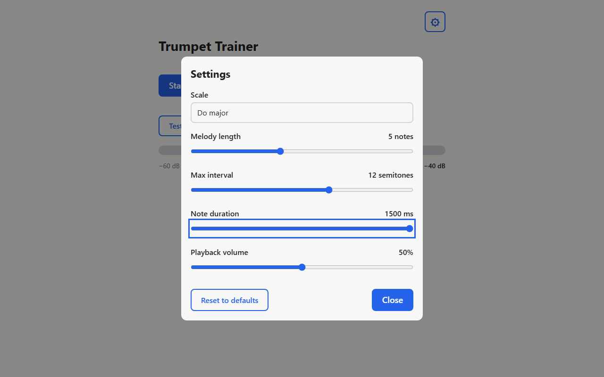

- ✅ **10. Playback volume: 0% … 100%, step 5** — min 0, max 100, step 5. Home → "0%", End → "100%"; ArrowRight sweep (21 values): 0%, 5%, 10%, 15%, 20%, 25%, 30%, 35%, 40%, 45%, 50%, 55%, 60%, 65%, 70%, 75%, 80%, 85%, 90%, 95%, 100%; aria-valuetext equals the visible text at every step. (Keyboard stepping stands in for dragging: both set the same input value.)
  Evidence: [10-volume-sweep.json](run-3/api/10-volume-sweep.json)

  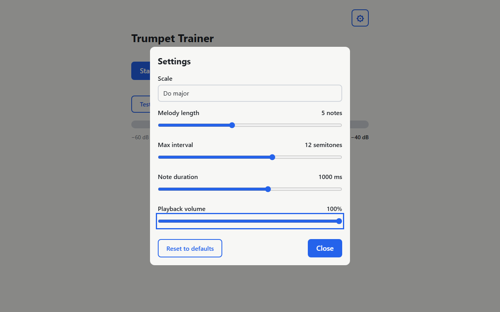

- ✅ **11. Max interval with Chromatic: 1 semitone … 18 semitones** — Scale Chromatic: min 1, max 18; fully left "1 semitone" (singular), fully right "18 semitones"; sweep 1 semitone, 2 semitones, 3 semitones, 4 semitones, 5 semitones, 6 semitones, 7 semitones, 8 semitones, 9 semitones, 10 semitones, 11 semitones, 12 semitones, 13 semitones, 14 semitones, 15 semitones, 16 semitones, 17 semitones, 18 semitones. Reset to defaults afterwards.
  Evidence: [11-max-interval-sweep.json](run-3/api/11-max-interval-sweep.json)

  

  

- ✅ **12. Each slider has a label and aria-valuetext = visible value** — Melody length: role slider by name ✓, aria-valuetext "5 notes" = visible "5 notes", AX name "Melody length"; Max interval: role slider by name ✓, aria-valuetext "12 semitones" = visible "12 semitones", AX name "Max interval"; Note duration: role slider by name ✓, aria-valuetext "1000 ms" = visible "1000 ms", AX name "Note duration"; Playback volume: role slider by name ✓, aria-valuetext "50%" = visible "50%", AX name "Playback volume". Labels checked with Playwright role queries and the Chromium accessibility tree (CDP); aria-valuetext checked on the DOM (what the DevTools Accessibility pane lists under "ARIA attributes"). **Caveat:** Chromium's *computed* AX value/valuetext for these native range inputs is the number, not the aria-valuetext (Melody length → "5", Max interval → "12", Note duration → "1000", Playback volume → "50"); confirm with NVDA / VoiceOver that "5 notes" etc. is announced. Screen-reader speech itself: manual.
  Evidence: [12-slider-a11y.json](run-3/api/12-slider-a11y.json)

  

## Scale combobox

- ✅ **13. Click: text selected, list (≈15rem) opens, Do major highlighted and in view** — Value "Do major" selected (0–8); list below the field inside the dialog, 146 options, max-height 240px (15 rem), rendered height 240 px, overflow-y auto, scrollable. First options: Chromatic, All scales, All majors, All natural minors, All dorian, All phrygian, All lydian, All mixolydian, All locrian, All major pentatonics, All minor pentatonics, Do major, Sol major …; highlighted (aria-selected / aria-activedescendant): "Do major" at index 11, in view (list scrollTop 248). Visual highlight: see screenshot.
  Evidence: [13-combobox-open.json](run-3/api/13-combobox-open.json)

  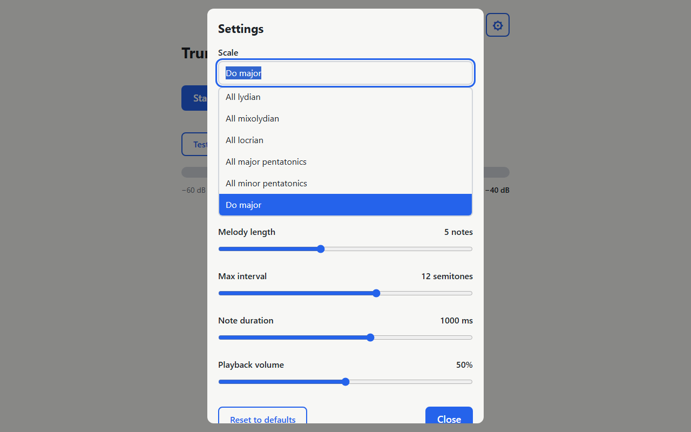

- ✅ **14. "bb major" narrows to Si♭ major / Si♭ major pentatonic** — Typed "bb major": options ["Si♭ major","Si♭ major pentatonic"], highlighted "Si♭ major".

  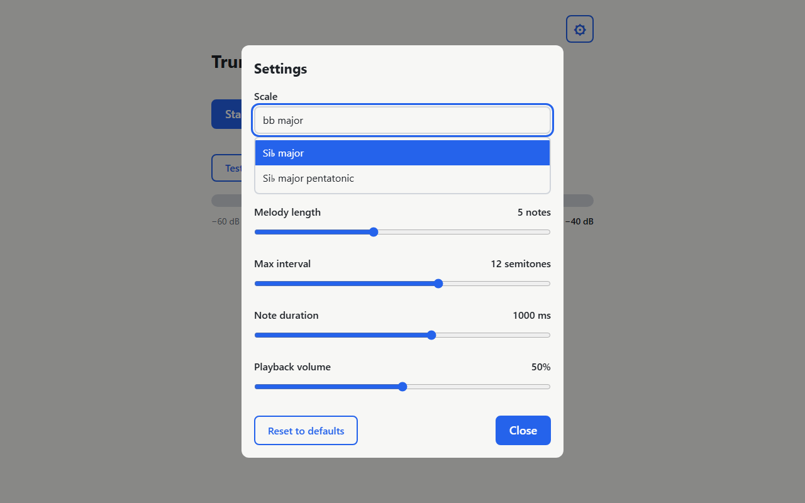

- ✅ **15. Enter selects; list closes; dialog stays open** — After Enter: list closed, field "Si♭ major", dialog open.

  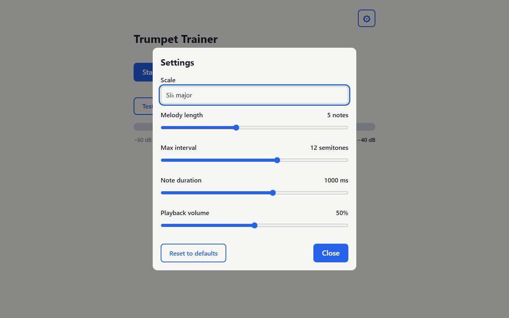

- ✅ **16. "xyz": one greyed "No matching scales" row; click / Enter do nothing** — "xyz" → single row "No matching scales" (aria-disabled, colour rgb(107, 114, 128) vs text rgb(31, 35, 40), cursor default). Click on it and Enter: list stays open, field stays "xyz", stored scaleId stays major:si-flat.
  Evidence: [16-no-matches.json](run-3/api/16-no-matches.json)

  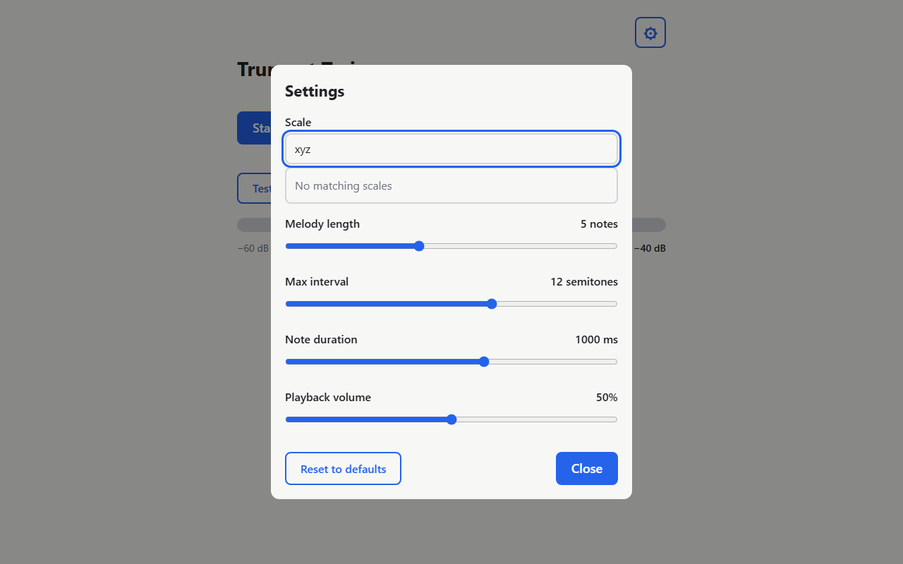

- ✅ **17. Esc closes only the list and reverts; second Esc closes the dialog** — First Esc: list closed, field "Si♭ major", dialog open. Second Esc: dialog closed.

  

- ✅ **18. "sol" + Tab (or click elsewhere) reverts** — "sol" showed 19 options (Sol major, Sol♭ major, Sol# minor, Sol minor …). Tab → list closed, field "Si♭ major", focus on "BODY" (not on Melody length: see item 6). Again "sol" + click on the dialog title → list closed, field "Si♭ major". Stored scaleId major:si-flat (unchanged).

  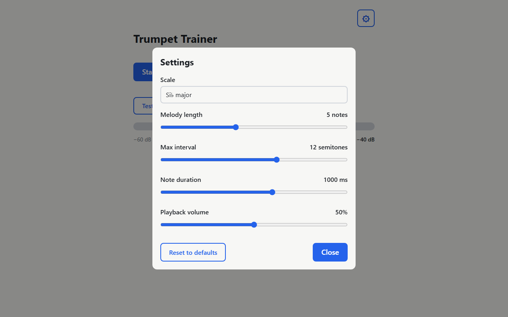

- ✅ **19. ArrowDown / ArrowUp: one at a time, no wrap, scrolls; Enter selects** — Start on "Si♭ major" (index 20); ArrowDown×3 / ArrowUp×3 trail 20 → 21 → 22 → 23 → 22 → 21 → 20. 25× ArrowUp stops at index 0 "Chromatic" (no wrap); 150× ArrowDown stops at 145 "La♭ minor pentatonic" (no wrap; list scrollTop 5608, option in view). ArrowUp → "Mi♭ minor pentatonic", Enter selects "Mi♭ minor pentatonic". (Home/End are not combobox keys here: the field is a text input.)
  Evidence: [19-arrows.json](run-3/api/19-arrows.json)

  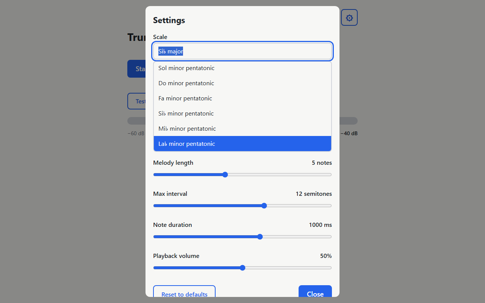

- ✅ **20. "f# dorian" + Enter; "sib" + mouse click; focus stays in the field** — "f# dorian" + Enter → "Fa# dorian". "sib" listed Si♭ major, Si♭ minor, Si♭ dorian, Si♭ phrygian, Si♭ lydian, Si♭ mixolydian, Si♭ locrian, Si♭ major pentatonic, Si♭ minor pentatonic; mouse click → "Si♭ major pentatonic", focus in the field: true, list closed: true. Stored scaleId major-pentatonic:si-flat.

  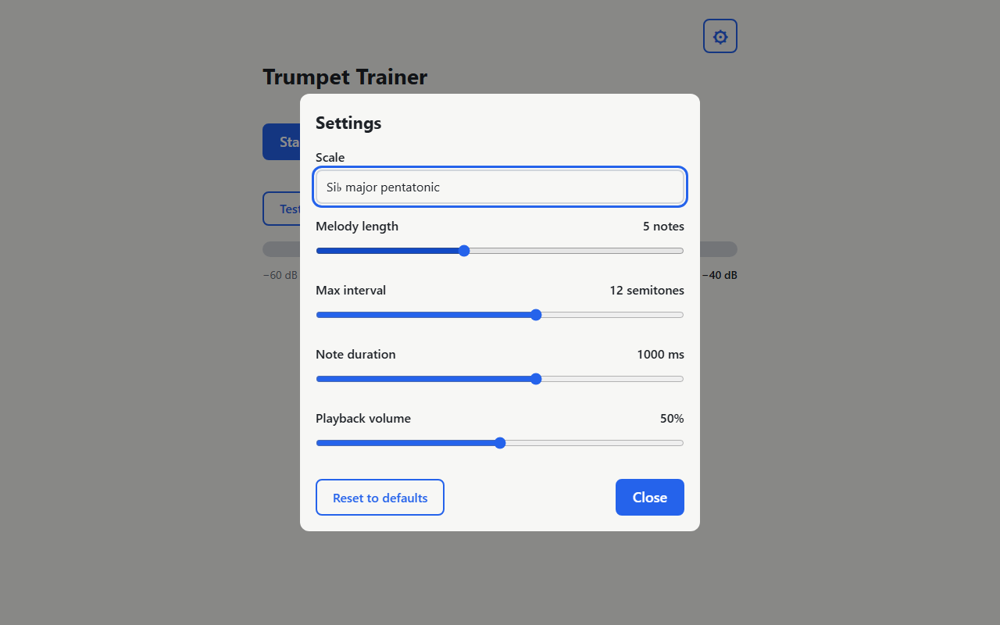

## Scale and max interval

- ✅ **21. Do major, max 2 → Do major pentatonic: 3 semitones, minimum 3** — Do major: max interval 2 (min 2). Do major pentatonic → "3 semitones", slider min 3; Home keeps 3.

  

- ✅ **22. Chromatic: stays 3, minimum 1** — Chromatic: value stays "3 semitones", min 1; the slider can go down to "1 semitone".

  

- ✅ **23. All scales: minimum 3** — All scales: slider min 3, value "3 semitones" (raised from 1 by selectScale).

  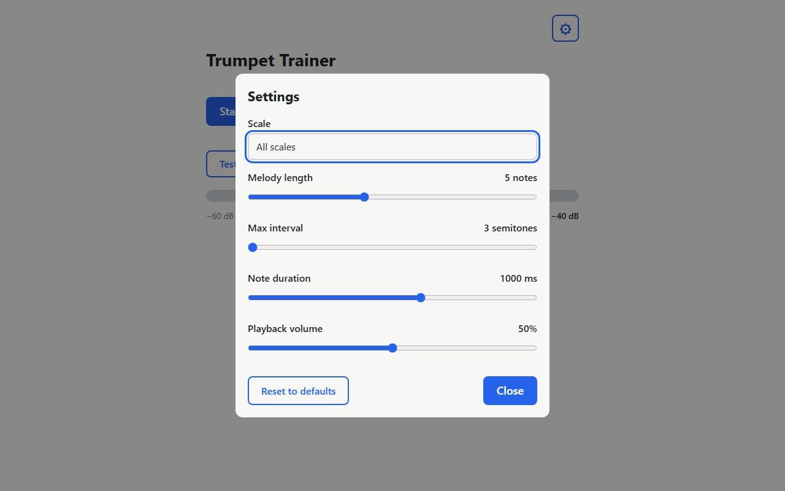

## Reset to defaults

- ✅ **24. Reset to defaults restores the five defaults; threshold stays −25 dB** — Changed to {"scale":"Fa major","Melody length":"7 notes","Max interval":"9 semitones","Note duration":"500 ms","Playback volume":"80%"} and threshold "Threshold: −25 dB". Reset → {"scale":"Do major","Melody length":"5 notes","Max interval":"12 semitones","Note duration":"1000 ms","Playback volume":"50%"}; threshold label still "Threshold: −25 dB" (stored -25).

  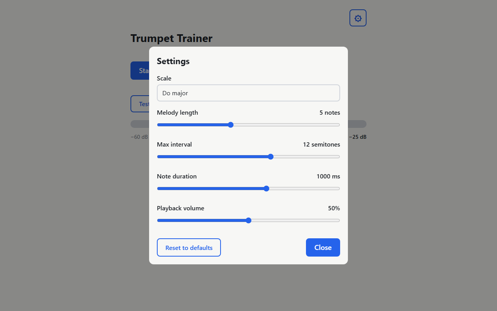

## Persistence

- ✅ **25. All six values restored after a reload ("All majors")** — After reload: {"scale":"All majors","Melody length":"7 notes","Max interval":"9 semitones","Note duration":"750 ms","Playback volume":"80%"}; "Threshold: −30 dB" (slider value -30).

  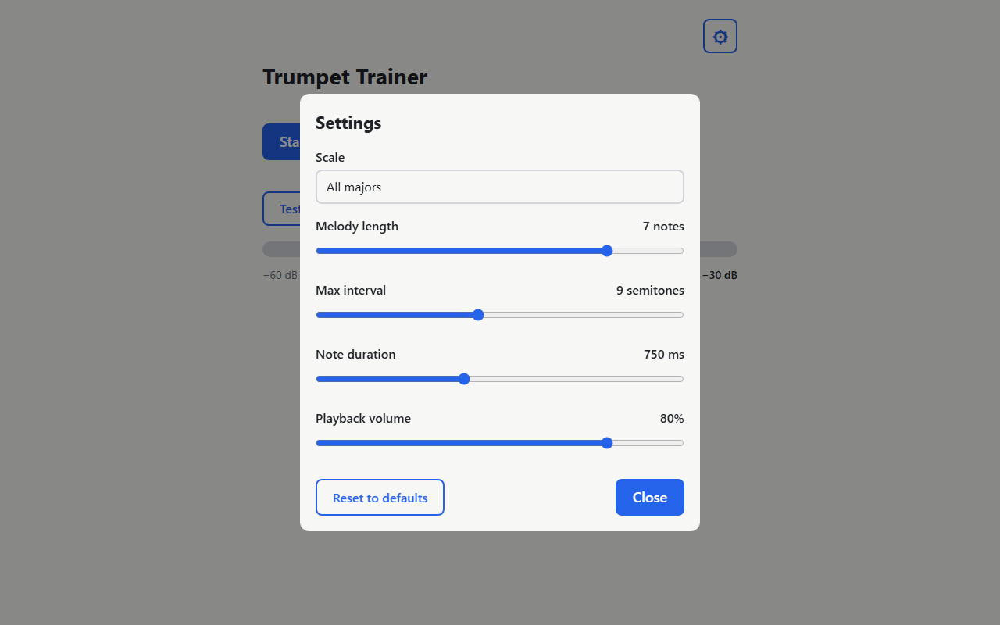

- ✅ **26. localStorage contents** — JSON.parse(localStorage['trumpet-trainer.settings.v1']) = `{"noteDurationMs":750,"melodyLength":7,"volume":0.8,"maxInterval":9,"scaleId":"group:major"}`; localStorage['trumpet-trainer.thresholdDb'] = `"-30"`.
  Evidence: [26-local-storage.json](run-3/api/26-local-storage.json)

- ✅ **27. Invalid stored data → defaults and "Threshold: −40 dB"** — App loaded normally (Start enabled true); dialog {"scale":"Do major","Melody length":"5 notes","Max interval":"12 semitones","Note duration":"1000 ms","Playback volume":"50%"}; "Threshold: −40 dB". localStorage cleared afterwards.

  

- ✅ **28. Blocked storage: works with defaults, changes apply in-visit, gone after reload, no console errors** — Blocked storage emulated by an init script whose window.localStorage getter throws SecurityError (as Chrome does with site data blocked); access → SecurityError, getBrowserStorage() → null. Defaults on load; changes applied during the visit {"scale":"Do major","Melody length":"4 notes","Max interval":"12 semitones","Note duration":"500 ms","Playback volume":"30%"}; exercise ?melody=71,71,71 played 3 boxes at [0.5,0.5] s/note (the in-memory 500 ms) and completed. After reload: {"scale":"Do major","Melody length":"5 notes","Max interval":"12 semitones","Note duration":"1000 ms","Playback volume":"50%"}, "Threshold: −40 dB". Console errors: 0 (0 incl. favicon). Incognito window: not separately automated (fresh context = empty storage).
  Evidence: [28-blocked-storage.json](run-3/api/28-blocked-storage.json)

  

  

## Melody length, scale and spelling (real exercises)

- ✅ **29. Melody length 3: 3 boxes, "Your turn: play note 1 of 3"** — Melody length 3 (note duration 250 ms to save time): 3 boxes, first listening status "Your turn: play note 1 of 3", played written MIDI [69,71,69]; Give up → Home (listening).

  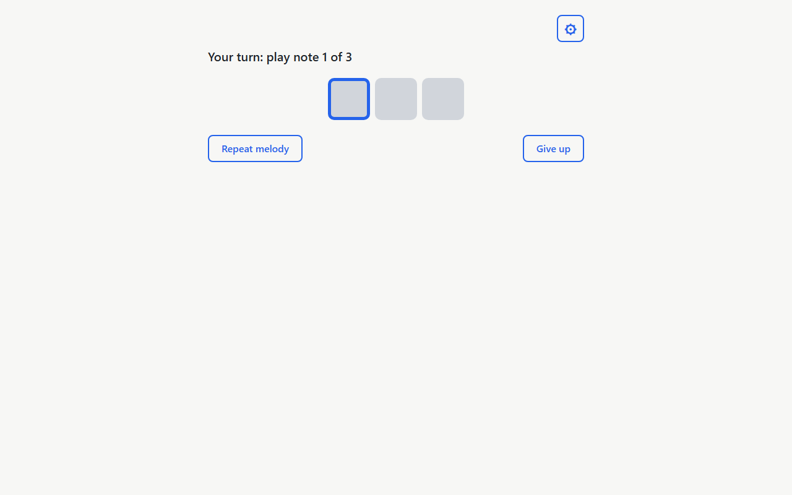

- ✅ **30. Melody length 8: 8 boxes in one centered row** — 1280 × 800: 8 boxes, 8 on one row (y 126), gaps left 4.0 / right 4.0 px (centered). Give up → Home (listening).

  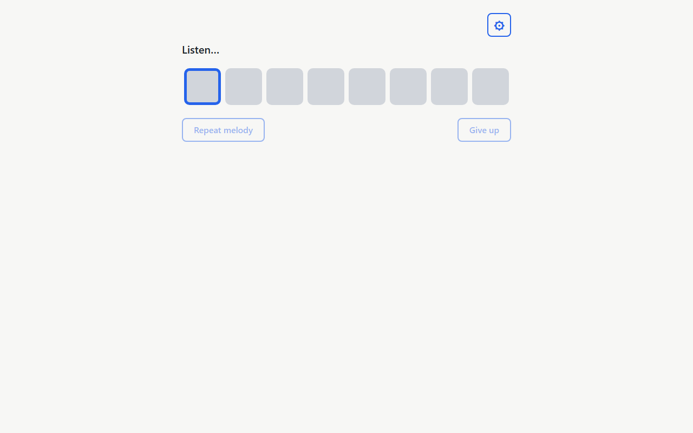

- ✅ **31. Fa major: notes in key, Si♭ never "La#"** — 4 real exercises (notes read from the synth's oscillator frequencies): La4 La3 Re4 Fa4 Do5 Fa4 Si♭3 La4 | La4 Sol4 Si♭3 Mi4 La3 Re4 Re4 Do5 | Si♭3 Sol3 Si♭3 Sol4 La3 Re4 La4 Si♭3 | Sol3 Fa4 Do4 Do4 Si♭3 Do4 Do4 Re4 — all in Fa major, 0 Si♭ shown as "Si♭4", no "La#". Module sample of 300: 411 Si♭, 0 La#, 0 out-of-key. Names come from the app's spellExercise (the UI only shows a name once a note is played correctly; the 440 Hz fake mic cannot play Fa major notes).
  Evidence: [31-fa-major.json](run-3/api/31-fa-major.json)

  

- ✅ **32. Sol♭ major: written Si (71) shown as "Do♭5"** — After 9 exercise(s) one started with written Si (71); the fake mic (concert A4 = written 71) played it and box 1 turned green showing "Do♭5". Module spellInKey([71], −6) = "Do♭5".
  Evidence: [32-sol-flat-major.json](run-3/api/32-sol-flat-major.json)

  

- ✅ **33. All majors: keys vary per exercise; Repeat replays the same notes** — 5 real exercises, candidate major keys from the played notes: [major:mi, major:si, major:fa-sharp, major:sol-flat, major:do-flat] [major:si, major:do-flat] [major:do-sharp, major:re-flat] [major:la, major:mi] [major:fa, major:si-flat] (different keys across exercises: true). Repeat in exercise 1: first [56,63,59,56,66,61,66,54] vs repeat [56,63,59,56,66,61,66,54] (identical: true). Module: 14 distinct keys in 100 group:major exercises.
  Evidence: [33-all-majors.json](run-3/api/33-all-majors.json)

  

- ✅ **34. Chromatic, max interval 1: steps ≤ 1 semitone** — 3 real exercises: 64,64,65,65,65,65,66,65 | 67,67,68,68,69,69,68,69 | 54,54,54,55,56,56,55,56; steps 0,1,0,0,0,1,1 | 0,1,0,1,0,1,1 | 0,0,1,1,0,1,1 (all ≤ 1). Module: largest step over 200 exercises = 1.
  Evidence: [34-chromatic-interval-1.json](run-3/api/34-chromatic-interval-1.json)

  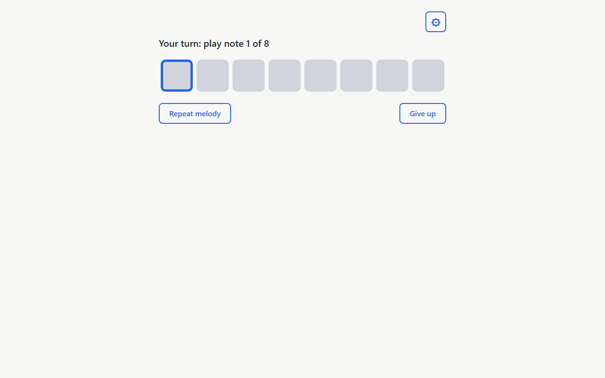

## Volume and note duration during training

- ✅ **35. Training dialog: only Note duration + Playback volume + hint; playback continues** — ?melody=71,60,60,60 at 1500 ms / 50%. Gear opened while "Listen…": sliders ["Note duration","Playback volume"], no Scale field, hint "Other settings can be changed on the home screen.". 0.8 s later status still "Listen…"; the 4-note playback (spacing [1.5,1.5,1.5] s) was not stopped (2 playSequence call(s) incl. StrictMode's cancelled one).
  Evidence: [35-training-dialog.json](run-3/api/35-training-dialog.json)

  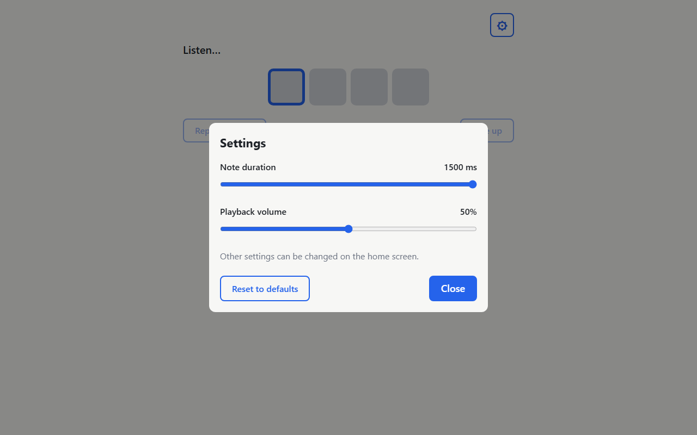

- ✅ **36. Volume 100% then 0% applied live to the playing note; no restart** — Master gain: cancelScheduledValues(1.04), setValueAtTime(0.5, 1.04), linearRampToValueAtTime(1, 1.06), cancelScheduledValues(1.472), setValueAtTime(1, 1.472), linearRampToValueAtTime(0, 1.492). Ramp to 1 at +0.97 s and to 0 at +1.40 s into the melody (last note ends +6.00 s), each 20.0 / 20.0 ms; 0 new oscillators, playback not stopped (no restart). Audible smoothness / silence at 0%: manual ear check.
  Evidence: [36-live-volume.json](run-3/api/36-live-volume.json)

  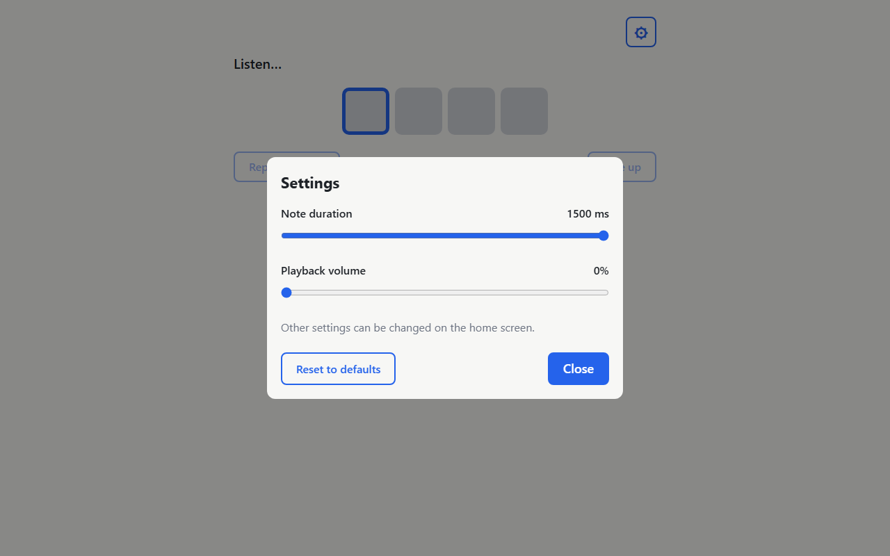

- ✅ **37. Note duration 250 ms applies on Repeat at the new volume; progress kept** — Duration set to 250 ms, dialog closed. Box states before Repeat ["done","active","pending","pending"], after ["done","active","pending","pending"] ("Your turn: play note 2 of 4"). Repeat playback: 4 notes, spacing [0.25,0.25,0.25] s, master gain 0 (0% from step 36). "Plays fast" audibly: manual.
  Evidence: [37-repeat.json](run-3/api/37-repeat.json)

  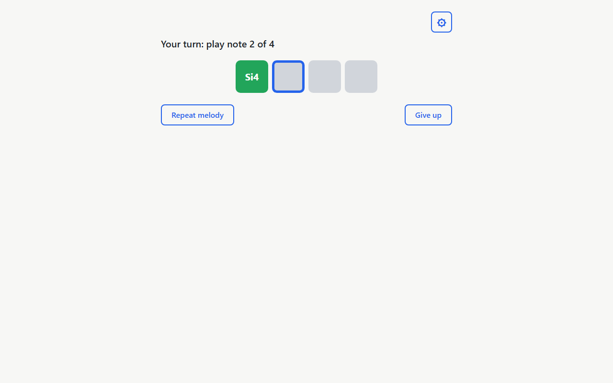

- ✅ **38. Listening continues with the dialog open (box turns green behind it)** — ?melody=71,60,60, dialog opened during "Listen…" and left open: box 1 turned done ("Si4") while the dialog was open (true); status "Your turn: play note 2 of 3". Real trumpet: manual.

  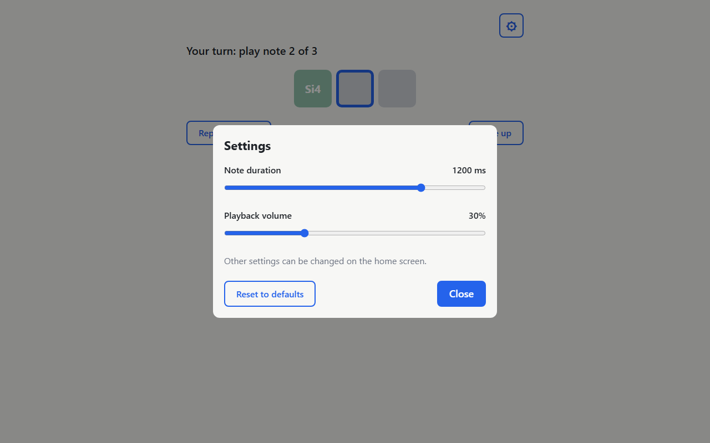

- ✅ **39. Training Reset: 1000 ms / 50%; Home-only settings unchanged** — Training dialog before {"scale":null,"Note duration":"1200 ms","Playback volume":"30%"} → Reset → {"scale":null,"Note duration":"1000 ms","Playback volume":"50%"}. Back Home: {"scale":"Sol major","Melody length":"4 notes","Max interval":"7 semitones","Note duration":"1000 ms","Playback volume":"50%"} (scale, length, max interval unchanged).

  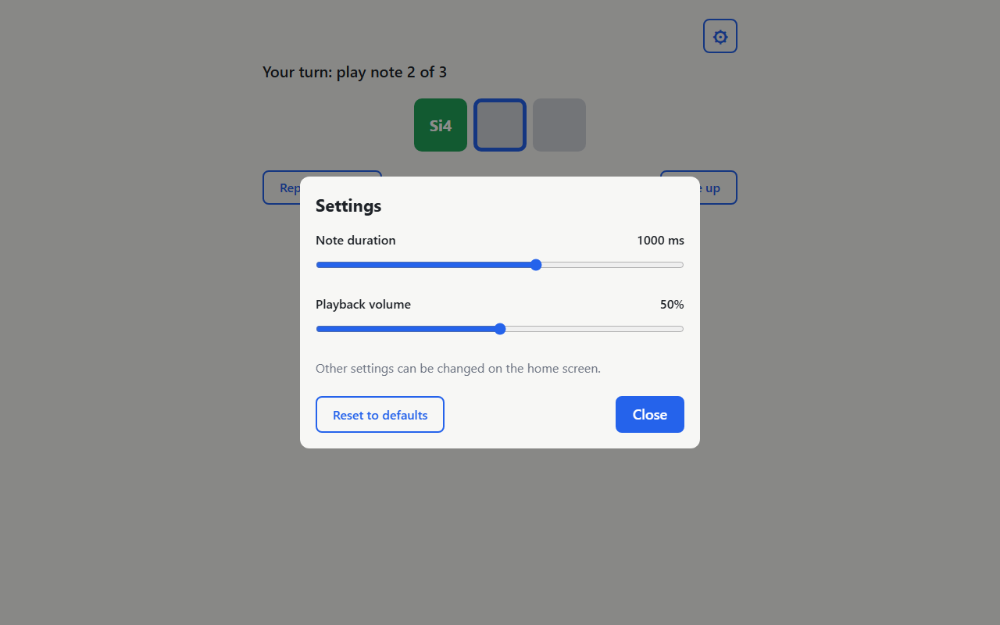

  

- ✅ **40. Dialog left open through completion switches to the five Home controls** — During training the open dialog showed ["Note duration","Playback volume"]; after all 3 notes completed and the app returned Home it stayed open with Scale "Sol major" + ["Melody length","Max interval","Note duration","Playback volume"].

  

## Deterministic ?melody= (e2e mode, port 5174)

- ✅ **41. ?melody=71,60,72 → 3 boxes regardless of Melody length** — Melody length 6; ?melody=71,60,72 → 3 boxes, played [71,60,72].

  

- ✅ **42. ?melody= with 8 notes → 8 boxes** — ?melody=71×8 → 8 boxes.

  

- ✅ **43. 2 and 9 notes are ignored (Melody length setting used)** — Melody length 4. ?melody= with 2 notes → 4 boxes, random melody [59,55,57,67]; ?melody= with 9 notes → 4 boxes, random melody [67,62,72,60].

  

  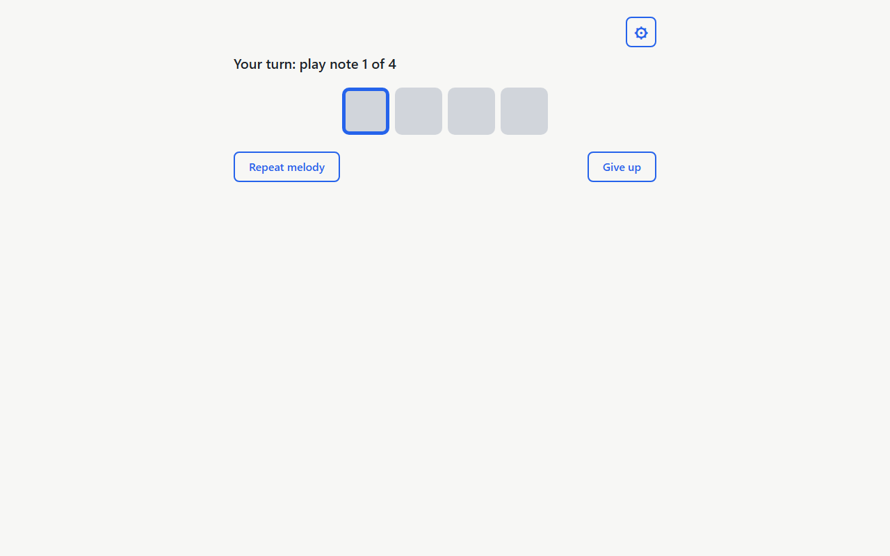

- ✅ **44. Fa major + ?melody=65,70,72 → Fa4 Si♭4 Do5; Chromatic / All scales contextual** — Fa major + ?melody=65,70,72: 3 boxes, played [65,70,72]; spellExercise(getTestExercise(id)) in the e2e page (what the reducer shows): Fa major ["Fa4","Si♭4","Do5"], Chromatic ["Fa4","La#4","Do5"], All scales ["Fa4","La#4","Do5"] (contextual: rising → sharp). The 440 Hz fake mic cannot play 65/70/72, so those names are not observable in boxes; UI cross-check with ?melody=71,71,71 (completed by the fake mic): Sol♭ major box "Do♭5", Chromatic box "Si4".
  Evidence: [44-melody-spelling.json](run-3/api/44-melody-spelling.json)

  

  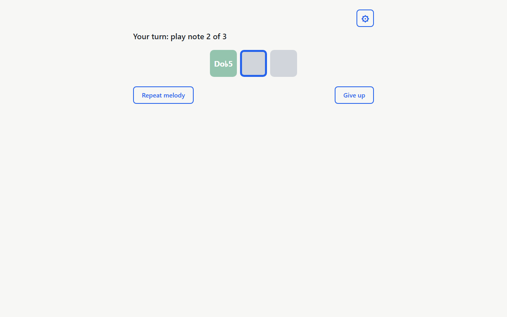

  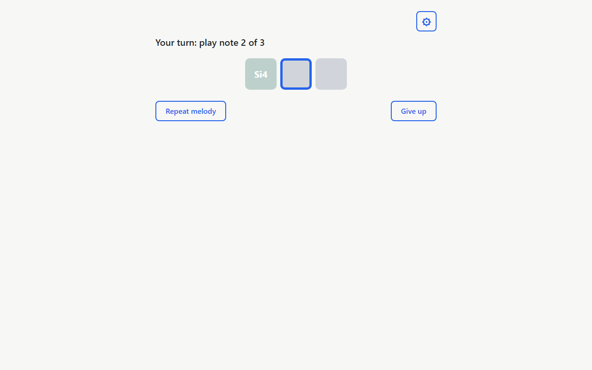

## Layout

- ✅ **45. 375 × 812: 5 + 3 centered, same size, no horizontal scroll** — 375 × 812: rows 5 + 3, all boxes 60.0 px square, row gaps 5.5/5.5, 73.5/73.5 (centered), scrollWidth 375 ≤ 375.
  Evidence: [45-layout-375.json](run-3/api/45-layout-375.json)

  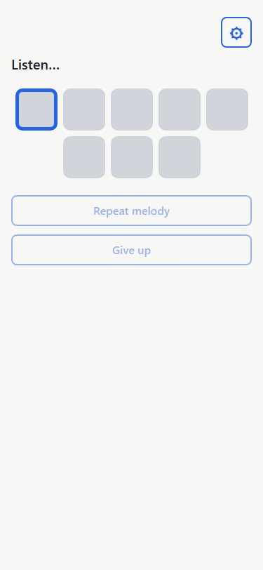

- ✅ **46. 320 px: 4 + 4, same size, no horizontal scroll** — 320 px: rows 4 + 4, box 60.0 px (375 px: 60.0 px), scrollWidth 320 ≤ 320.

  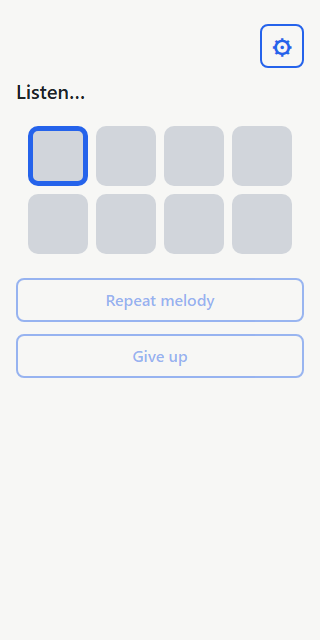

- ✅ **47. 375 px: dialog is a bottom sheet with rounded top corners; scrolls when taller** — 375 × 812: dialog x 0, width 375, bottom 812 = viewport height; radii 12px 12px 0px 0px (rounded top only); overflow-y auto. With the scale list open at 812 px: scrollHeight 804 / clientHeight 780 (scrolls); at 375 × 600: 804/568, scrollTop after scrolling 236.
  Evidence: [47-dialog-sheet.json](run-3/api/47-dialog-sheet.json)

  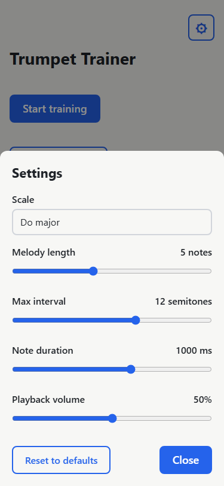

  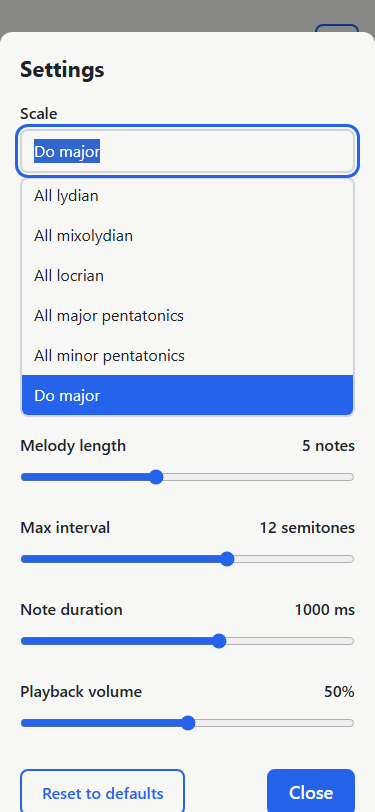

  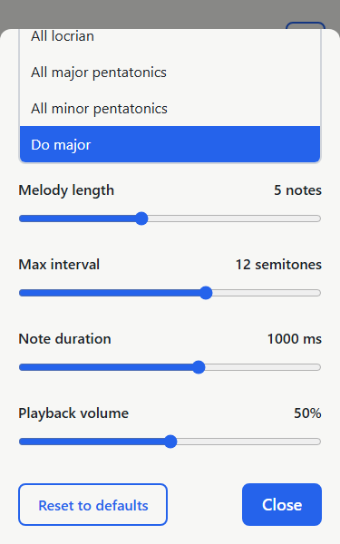

- ⏭️ **48. Real phones (Android Chrome, iOS Safari) and desktop Firefox; monochrome gear** — Manual: real devices (Android Chrome, iOS Safari via HTTPS) and desktop Firefox are not automated. Automated part: the gear text is ["U+2699","U+FE0E"] (U+2699 GEAR + U+FE0E VARIATION SELECTOR-15 = text presentation, so it should render monochrome), inside an aria-hidden="true" span, font-family system-ui, -apple-system, "Segoe UI", Roboto, sans-serif; Chromium rendering in the screenshot.

  

## Production build

- ✅ **49. Preview: setting restored after reload; ?melody= ignored** — http://localhost:4173/trumpet-trainer/: Melody length 6 + Note duration 600 ms restored after reload ({"scale":"Do major","Melody length":"6 notes","Max interval":"12 semitones","Note duration":"600 ms","Playback volume":"50%"}). ?melody=71,71,71 → 6 boxes, random melody [69,60,55,65,64,62] (ignored in the production build).

  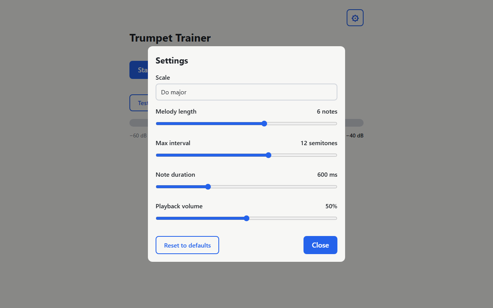

  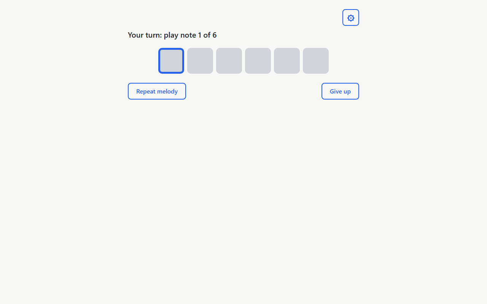

## Regression

- ✅ **50. lint, typecheck, unit tests (1285), script tests (32), build, e2e (9)** — `npm run lint` exit 0, `npm run typecheck` exit 0, `npm test` exit 0, `npm run test:scripts` exit 0, `npm run build` exit 0, `npm run test:e2e` exit 0. Unit tests: 1285 passed, 0 failed (expected 1285); script tests: 32 passed, 0 failed (expected 32); e2e: 9 passed, 0 failed (expected 9).
  Evidence: [50-lint.txt](run-3/output/50-lint.txt), [50-typecheck.txt](run-3/output/50-typecheck.txt), [50-unit-tests.txt](run-3/output/50-unit-tests.txt), [50-script-tests.txt](run-3/output/50-script-tests.txt), [50-build.txt](run-3/output/50-build.txt), [50-e2e.txt](run-3/output/50-e2e.txt)

- ✅ **51. Part 1 steps 1–12 and 15 re-run** — 13/13 Part 1 steps pass (1–12 and 15, run in the 5173 dev-server page as in Runs 1–2; steps 13–14 are superseded by items 29–44).
  - ✅ Part 1 step 1. Removed and new constants — Got `[undefined,undefined,undefined,1000,0.5,"major:do"]` ([p1-01-constants.json](run-3/api/p1-01-constants.json))
  - ✅ Part 1 step 2. SCALE_OPTIONS has 146 options — Got `146` ([p1-02-scale-options-length.json](run-3/api/p1-02-scale-options-length.json))
  - ✅ Part 1 step 3. First 11 option names (chromatic + 10 groups) — Got `["Chromatic","All scales","All majors","All natural minors","All dorian","All phrygian","All lydian","All mixolydian","All locrian","All major pentatonics","All minor pentatonics"]` ([p1-03-first-11-names.json](run-3/api/p1-03-first-11-names.json))
  - ✅ Part 1 step 4. Locrian tonic names in key-signature order — Got `"Si Fa# Do# Sol# Re# La# Mi# Si# Mi La Re Sol Do Fa Si♭"` ([p1-04-locrian-tonics.json](run-3/api/p1-04-locrian-tonics.json))
  - ✅ Part 1 step 5. searchScaleOptions (English letters, b/#) — Got `[["Si♭ major","Si♭ major pentatonic"],["Fa# dorian"]]` ([p1-05-search.json](run-3/api/p1-05-search.json))
  - ✅ Part 1 step 6. minMaxInterval for chromatic / major / pentatonic group / all — Got `[1,2,3,3]` ([p1-06-min-max-interval.json](run-3/api/p1-06-min-max-interval.json))
  - ✅ Part 1 step 7. spellInKey (Si#3, Mi#4, Do♭5) — Got `[["Si#3","Mi#4","Do#4"],["Sol♭4","Do♭5","Si♭4"]]` ([p1-07-spell-in-key.json](run-3/api/p1-07-spell-in-key.json))
  - ✅ Part 1 step 8. generateExercise worked example (scripted rng) — Got `[[55,62,72],"major:do"]` ([p1-08-generate-exercise-worked-example.json](run-3/api/p1-08-generate-exercise-worked-example.json))
  - ✅ Part 1 step 9. Random group:major exercises fit their key, steps ≤ 2 — Exact expression: `major:si-flat Re4 Mi♭4 Mi♭4 Mi♭4 Fa4 Mi♭4 Mi♭4 Fa4`, `major:fa-sharp Re#4 Re#4 Re#4 Mi#4 Re#4 Do#4 Si3 Do#4`, `major:si-flat Sol4 Fa4 Mi♭4 Re4 Mi♭4 Mi♭4 Fa4 Fa4`, `major:la La4 La4 Sol#4 Fa#4 Sol#4 Sol#4 Fa#4 Mi4`, `major:re-flat Sol♭3 Sol♭3 La♭3 La♭3 Sol♭3 Sol♭3 La♭3 La♭3`; a second sample of 5 checked note by note (major scale, in key, |step| ≤ 2, names map back to MIDI). ([p1-09-group-major-check.json](run-3/api/p1-09-group-major-check.json))
  - ✅ Part 1 step 10. normalizeSettings field-by-field validation — Got `{"noteDurationMs":750,"melodyLength":5,"volume":0.5,"maxInterval":12,"scaleId":"major:fa"}` ([p1-10-normalize-settings.json](run-3/api/p1-10-normalize-settings.json))
  - ✅ Part 1 step 11. Storage adapter round-trip across a reload — After page.reload(): `[7,-35]` (expected `[7,-35]`). ([p1-11-storage-round-trip.json](run-3/api/p1-11-storage-round-trip.json))
  - ✅ Part 1 step 12. Invalid stored JSON falls back to defaults — Returned `{"noteDurationMs":1000,"melodyLength":5,"volume":0.5,"maxInterval":12,"scaleId":"major:do"}` without throwing; localStorage cleared (length 0). ([p1-12-invalid-json-defaults.json](run-3/api/p1-12-invalid-json-defaults.json))
  - ✅ Part 1 step 15. setVolume mid-melody ramps the master gain — AudioContext "running". linearRampToValueAtTime(1) issued 2.000 s after playSequence, ramp length 20.0 ms; master initial gain 0.2. Audible smoothness: manual. ([p1-15-set-volume-audio-log.json](run-3/api/p1-15-set-volume-audio-log.json))

## Comparison with previous run

Run 2 validated Part 1 only (items 1–16 + Appendix A 17–27); Part 2 items 1–50 are validated for the first time here, so the only comparable items are the Part 1 steps re-run in item 51.

| Part 1 step | Run 2 | Run 3 |
|---|---|---|
| 1. Removed and new constants | ✅ PASS | ✅ PASS |
| 2. SCALE_OPTIONS has 146 options | ✅ PASS | ✅ PASS |
| 3. First 11 option names (chromatic + 10 groups) | ✅ PASS | ✅ PASS |
| 4. Locrian tonic names in key-signature order | ✅ PASS | ✅ PASS |
| 5. searchScaleOptions (English letters, b/#) | ✅ PASS | ✅ PASS |
| 6. minMaxInterval for chromatic / major / pentatonic group / all | ✅ PASS | ✅ PASS |
| 7. spellInKey (Si#3, Mi#4, Do♭5) | ✅ PASS | ✅ PASS |
| 8. generateExercise worked example (scripted rng) | ✅ PASS | ✅ PASS |
| 9. Random group:major exercises fit their key, steps ≤ 2 | ✅ PASS | ✅ PASS |
| 10. normalizeSettings field-by-field validation | ✅ PASS | ✅ PASS |
| 11. Storage adapter round-trip across a reload | ✅ PASS | ✅ PASS |
| 12. Invalid stored JSON falls back to defaults | ✅ PASS | ✅ PASS |
| 15. setVolume mid-melody ramps the master gain | ✅ PASS | ✅ PASS |

No regressions in the re-run Part 1 steps.

## Manual follow-up

The script automates everything it can; these parts still need a human:

- **3 — Focus ring:** the gear visibly shows a focus ring after Esc (script checks `:focus-visible`; see screenshot).
- **7 — Real permission prompt:** reset the mic permission and look at the page while Chrome's prompt is shown (script simulated it with a 2 s delayed getUserMedia).
- **12 — Screen reader:** NVDA / VoiceOver announce each slider's label and value text (script checked the Chromium accessibility tree).
- **36 — Audible:** volume changes are smooth (no clicks) and 0% is silent (script verified the 20 ms master-gain ramps).
- **37 — Audible:** the repeated melody plays fast (≈ 0.25 s per note).
- **38 / 29–34 — Real trumpet:** play the active note in tune (the fake mic only plays written Si4).
- **48 — Devices:** steps 1–2, 13 and 36 on Android Chrome, iOS Safari (HTTPS) and desktop Firefox; the gear renders monochrome.
